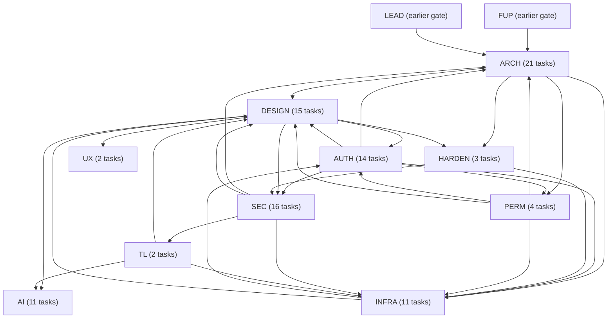
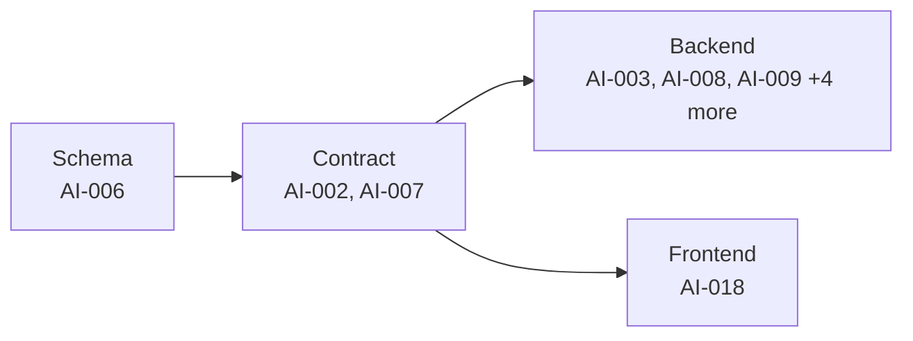
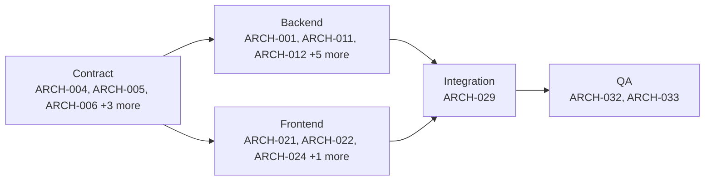
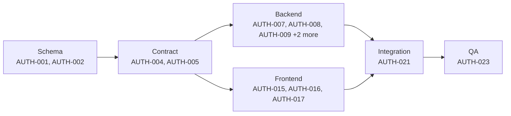
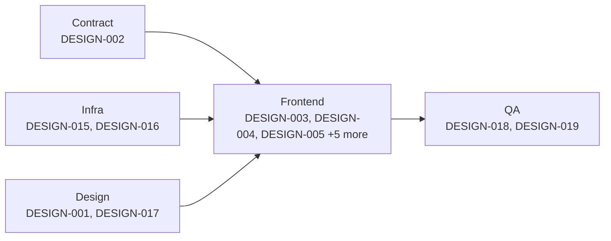
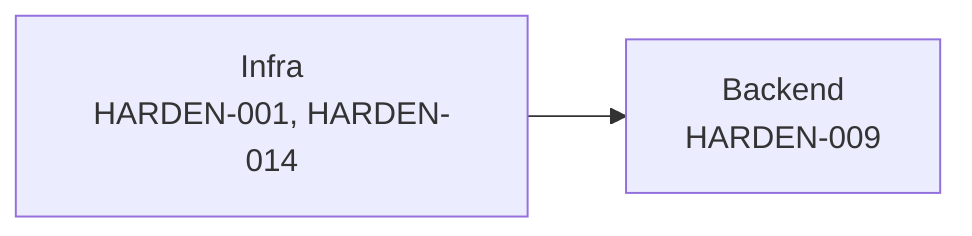
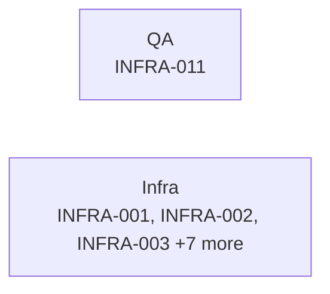
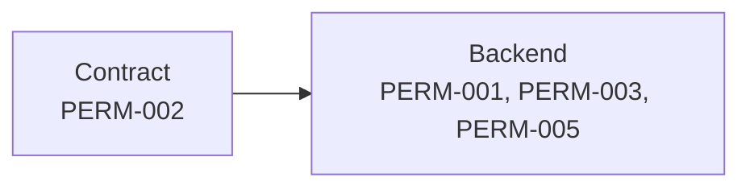
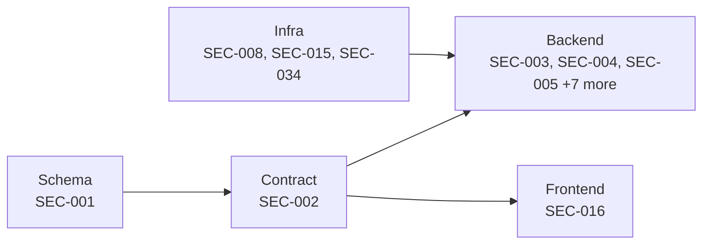
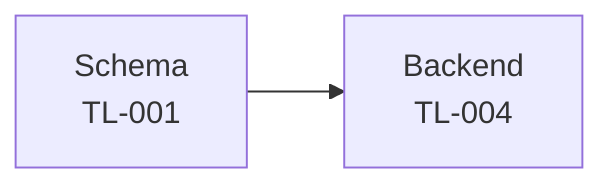

# G0 -- Foundation

**Scope:** tenancy, auth, bootstrap, CI, design system. 99 tasks across 10 domains: AI, ARCH, AUTH, DESIGN, HARDEN, INFRA, PERM, SEC, TL, UX.

> `gate` is a roadmap grouping label (see [`12-roadmap.md`](../12-roadmap.md)), not a scheduling dependency. The arrows below are real `depends_on` edges rolled up to domain level; each task's own row further down lists its precise dependencies.

## Domain-level dependency graph

## AI

| ID | Title | Track | Size | Depends On | Spec Refs |
|---|---|---|---|---|---|
| TASK-AI-002 | Define internal event-log write and query API contract | backend | S | TASK-TL-001 | SN-AI-010 |
| TASK-AI-003 | Instrument event emission across core domain write paths | backend | L | TASK-TL-001, TASK-AI-002 | SN-AI-010, SN-AI-015 |
| TASK-AI-006 | Create llm_call_log schema | backend | S | - | SN-AI-031 |
| TASK-AI-007 | Define the LlmProvider port contract | backend | S | - | SN-AI-030 |
| TASK-AI-008 | Implement LlmProvider adapter(s) and per-call usage recording | backend | M | TASK-AI-006, TASK-AI-007 | SN-AI-030, SN-AI-031 |
| TASK-AI-009 | Implement prompt version control and review workflow | backend | M | TASK-AI-006 | SN-AI-032 |
| TASK-AI-010 | Build the AI capability evaluation harness and CI gate | backend | M | TASK-AI-007 | SN-AI-033 |
| TASK-AI-011 | Implement graceful AI degradation and org-level AI off-switch | backend | M | TASK-AI-007 | SN-AI-034, SN-AI-045 |
| TASK-AI-012 | Design tenant-scoped retrieval index filtering (V2 prep) | backend | M | - | SN-AI-035 |
| TASK-AI-013 | Implement AI governance guardrails: no-training, minimisation, confirmation gate, uncertainty surfacing | backend | M | TASK-AI-007, TASK-AI-008 | SN-AI-003, SN-AI-040, SN-AI-041, SN-AI-042, SN-AI-043 |
| TASK-AI-018 | Build AI settings, governance and cost-dashboard UI | frontend | M | TASK-AI-007, TASK-DESIGN-003, TASK-DESIGN-004, TASK-DESIGN-022 | SN-AI-034, SN-AI-044, SN-AI-045 |

## ARCH

| ID | Title | Track | Size | Depends On | Spec Refs |
|---|---|---|---|---|---|
| TASK-ARCH-001 | Scaffold company-standard app structure with enforced domain boundaries and four-deployable topology | backend | M | - | SN-ARCH-001, SN-ARCH-002, SN-ARCH-003, SN-ARCH-109 |
| TASK-ARCH-004 | Define core API envelope, error catalogue and OpenAPI/typed-client generation pipeline | backend | L | - | SN-ARCH-080, SN-ARCH-082, SN-ARCH-083, SN-ARCH-084, SN-ARCH-086, SN-ARCH-081 |
| TASK-ARCH-005 | Implement /bootstrap response contract | backend | S | TASK-ARCH-004 | SN-ARCH-088 |
| TASK-ARCH-006 | Define pagination, filtering/sorting query DSL and global search contract | backend | M | TASK-ARCH-004 | SN-ARCH-089, SN-ARCH-090 |
| TASK-ARCH-007 | Define Idempotency-Key and optimistic-concurrency middleware contract | backend | S | TASK-ARCH-004 | SN-ARCH-091 |
| TASK-ARCH-008 | Define bulk-operation preview/execute pattern and async job polling contract | backend | M | TASK-ARCH-004 | SN-ARCH-092 |
| TASK-ARCH-009 | Define relative-move ordering convention and presigned-upload contract | backend | S | TASK-ARCH-004 | SN-ARCH-093, SN-ARCH-094 |
| TASK-ARCH-011 | Implement read/write DB replica routing | backend | S | TASK-AUTH-002 | SN-ARCH-012 |
| TASK-ARCH-012 | Implement tenant-scoped Redis caching layer | backend | M | TASK-AUTH-002, TASK-ARCH-005 | SN-ARCH-013 |
| TASK-ARCH-013 | Implement /bootstrap payload assembly service | backend | M | TASK-ARCH-005, TASK-ARCH-012, TASK-PERM-003, TASK-FUP-004, TASK-LEAD-011 | SN-ARCH-088 |
| TASK-ARCH-018 | Implement outbound resilience framework | backend | M | TASK-ARCH-004 | SN-ARCH-042 |
| TASK-ARCH-019 | Scaffold external provider port interfaces | backend | S | - | SN-ARCH-040, SN-WA-023, SN-WA-025 |
| TASK-ARCH-020 | Implement structured logging with PII redaction and distributed tracing | backend | M | - | SN-ARCH-050, SN-ARCH-051, SN-SEC-010, SN-PRIV-002, SN-PRIV-003 |
| TASK-ARCH-021 | Build the app shell: route tree, navigation rail/tabs, global +New action | frontend | L | TASK-ARCH-005 | SN-ARCH-030, SN-ARCH-099, SN-ARCH-098 |
| TASK-ARCH-022 | Set up frontend state-management architecture and shared optimistic-mutation pattern | frontend | M | TASK-ARCH-004 | SN-ARCH-031, SN-ARCH-033, SN-UX-011 |
| TASK-ARCH-024 | Implement offline resilience: service worker, queued writes and flaky-connection handling | frontend | M | TASK-ARCH-022 | SN-ARCH-035, SN-UX-012 |
| TASK-ARCH-026 | Build URL-state synchronisation utility for filters, sort and pagination | frontend | S | TASK-ARCH-006 | SN-LEAD-082, SN-ARCH-105 |
| TASK-ARCH-029 | Integrate bootstrap-driven navigation, warnings and counts into the app shell end-to-end | qa | S | TASK-ARCH-013, TASK-ARCH-021 | SN-ARCH-088, SN-ARCH-099 |
| TASK-ARCH-032 | QA: verify tenant isolation suite green in CI | qa | S | TASK-SEC-004, TASK-ARCH-029, TASK-PERM-002, TASK-PERM-003 | SN-ARCH-020, SN-SEC-003 |
| TASK-ARCH-033 | QA: verify API contract conformance | qa | M | TASK-ARCH-004, TASK-ARCH-005, TASK-ARCH-006, TASK-ARCH-007, TASK-ARCH-008, TASK-ARCH-009 | SN-ARCH-080, SN-ARCH-082, SN-ARCH-083, SN-ARCH-084, SN-ARCH-086, SN-ARCH-087, SN-ARCH-088, SN-ARCH-089, SN-ARCH-090, SN-ARCH-091, SN-ARCH-092, SN-ARCH-093, SN-ARCH-094 |
| TASK-ARCH-036 | Record architecture-bible deviations and reconcile ADR-0008 with the shipped app structure | backend | S | - | SN-ARCH-001, SN-ARCH-002, SN-ARCH-080, SN-ARCH-082, SN-ARCH-084, SN-AUTH-006 |

## AUTH

| ID | Title | Track | Size | Depends On | Spec Refs |
|---|---|---|---|---|---|
| TASK-AUTH-001 | Create auth & session schema (users, OTP challenges, sessions, magic links) | backend | M | - | SN-AUTH-001..006, SN-AUTH-060, SN-AUTH-061, SN-AUTH-065 |
| TASK-AUTH-002 | Create organisation, membership, invite & acquisition schema | backend | M | - | SN-AUTH-007, SN-AUTH-014, SN-AUTH-020, SN-AUTH-021, SN-AUTH-022, SN-SEC-003, SN-ARCH-020, SN-AUTH-062, SN-AUTH-063, SN-AUTH-064 |
| TASK-AUTH-004 | Define auth/session/magic-link route contracts | backend | M | TASK-AUTH-001 | SN-AUTH-001..007, SN-AUTH-060 |
| TASK-AUTH-005 | Define signup/org/invite route contracts | backend | M | TASK-AUTH-002 | SN-AUTH-010..014, SN-AUTH-020..022 |
| TASK-AUTH-007 | Implement OTP generation, delivery and verification logic | backend | M | TASK-AUTH-004, TASK-INFRA-004 | SN-AUTH-001..005, SN-ARCH-011 |
| TASK-AUTH-008 | Implement session issuance, rotation and multi-org switching | backend | M | TASK-AUTH-004, TASK-AUTH-002 | SN-AUTH-006, SN-AUTH-007 |
| TASK-AUTH-009 | Implement scoped magic-link issuance and resolution | backend | S | TASK-AUTH-004 | SN-AUTH-060 |
| TASK-AUTH-010 | Implement signup flow and server-side attribution capture | backend | M | TASK-AUTH-005 | SN-AUTH-010..014 |
| TASK-AUTH-011 | Implement organisation auto-creation and invite lifecycle | backend | M | TASK-AUTH-005, TASK-PERM-002 | SN-AUTH-020..022 |
| TASK-AUTH-015 | Build sign-in screens (identifier, verify, org picker) | frontend | M | TASK-AUTH-004, TASK-DESIGN-003, TASK-DESIGN-004 | SN-AUTH-002, SN-AUTH-006, SN-AUTH-007 |
| TASK-AUTH-016 | Build server-rendered signup screens | frontend | M | TASK-AUTH-005 | SN-AUTH-010..013 |
| TASK-AUTH-017 | Build invite acceptance screen | frontend | S | TASK-AUTH-005 | SN-AUTH-021 |
| TASK-AUTH-021 | Integrate auth/signup/invite flows end-to-end | qa | M | TASK-AUTH-007, TASK-AUTH-008, TASK-AUTH-009, TASK-AUTH-010, TASK-AUTH-011, TASK-AUTH-015, TASK-AUTH-016, TASK-AUTH-017 | SN-AUTH-001..007, SN-AUTH-010..014, SN-AUTH-020..022, SN-AUTH-060 |
| TASK-AUTH-023 | QA: verify auth/signup/invite against acceptance criteria | qa | S | TASK-AUTH-021 | SN-AUTH-001..022 |

## DESIGN

| ID | Title | Track | Size | Depends On | Spec Refs |
|---|---|---|---|---|---|
| TASK-DESIGN-001 | Configure design token foundation as Tailwind theme | design | M | - | SN-DS-010, SN-DS-011, SN-DS-012, SN-DS-020, SN-DS-021, SN-DS-022 |
| TASK-DESIGN-002 | Define component prop-API contracts for the full component library | frontend | M | TASK-DESIGN-001 | SN-DS-030, SN-DS-031, SN-DS-032 |
| TASK-DESIGN-003 | Implement foundation form-control components | frontend | L | TASK-DESIGN-002 | SN-DS-030, SN-DS-031, SN-DS-080, SN-DS-081 |
| TASK-DESIGN-004 | Implement foundation display/action primitives | frontend | M | TASK-DESIGN-002 | SN-DS-030, SN-DS-031, SN-DS-032 |
| TASK-DESIGN-005 | Implement layout components with the mandatory six-state data-surface pattern and shared cross-cutting state primitives | frontend | L | TASK-DESIGN-002, TASK-ARCH-004 | SN-DS-030, SN-DS-040, SN-DS-041, SN-DS-043, SN-ARCH-030 |
| TASK-DESIGN-006 | Implement data components (Table/Grid/List/pagination) with zero-CLS skeleton parity | frontend | L | TASK-DESIGN-002, TASK-DESIGN-003, TASK-DESIGN-005 | SN-DS-030, SN-DS-040, SN-DS-042 |
| TASK-DESIGN-012 | Implement the shared motion system | frontend | S | TASK-DESIGN-001 | SN-DS-050, SN-DS-051, SN-DS-052 |
| TASK-DESIGN-013 | Implement responsive shell and mobile bottom navigation | frontend | M | TASK-DESIGN-001, TASK-DESIGN-004 | SN-DS-060, SN-DS-061, SN-DS-062 |
| TASK-DESIGN-014 | Implement the shared accessibility framework | frontend | M | TASK-DESIGN-001, TASK-DESIGN-002 | SN-DS-070 |
| TASK-DESIGN-015 | Enforce frontend performance budgets in CI | infra | M | TASK-DESIGN-001, TASK-INFRA-001, TASK-ARCH-021 | SN-DS-010, SN-ARCH-034 |
| TASK-DESIGN-016 | Enforce tokens-only lint rule (no raw hex/spacing) | infra | S | TASK-DESIGN-001 | SN-DS-081 |
| TASK-DESIGN-017 | Document the full component library in Storybook | design | M | TASK-DESIGN-002, TASK-DESIGN-003, TASK-DESIGN-004, TASK-DESIGN-005, TASK-DESIGN-006 | SN-DS-082 |
| TASK-DESIGN-018 | Verify accessibility and performance conformance of the component library | qa | M | TASK-DESIGN-003, TASK-DESIGN-004, TASK-DESIGN-005, TASK-DESIGN-006, TASK-DESIGN-013, TASK-DESIGN-014, TASK-DESIGN-015 | SN-DS-070 |
| TASK-DESIGN-019 | Demonstrate the G0 foundation gate exit criterion | qa | S | TASK-DESIGN-001, TASK-DESIGN-002, TASK-DESIGN-003, TASK-DESIGN-004, TASK-DESIGN-005, TASK-DESIGN-006, TASK-DESIGN-012, TASK-DESIGN-013, TASK-DESIGN-014, TASK-DESIGN-015, TASK-DESIGN-016, TASK-SEC-004, TASK-INFRA-004, TASK-TL-001, TASK-SEC-001, TASK-ARCH-020, TASK-PERM-003, TASK-ARCH-013, TASK-AUTH-007, TASK-AUTH-008 | SN-SEC-003, SN-ARCH-011, SN-SEC-010, SN-AI-010 |
| TASK-DESIGN-022 | Implement shared dataviz/chart component set | frontend | M | TASK-DESIGN-002 | SN-DS-030 |

## HARDEN

| ID | Title | Track | Size | Depends On | Spec Refs |
|---|---|---|---|---|---|
| TASK-HARDEN-001 | Enforce performance and bundle budgets in CI | infra | M | TASK-ARCH-001 | SN-NFR-001, SN-NFR-002 |
| TASK-HARDEN-009 | Implement internationalisation scaffolding for English-at-launch, structured for more | backend | M | TASK-DESIGN-001 | SN-NFR-030 |
| TASK-HARDEN-014 | Select hosting and managed services; provision India primary region | infra | M | - | SN-ARCH-070, SN-ARCH-071 |

## INFRA

| ID | Title | Track | Size | Depends On | Spec Refs |
|---|---|---|---|---|---|
| TASK-INFRA-001 | Build CI/CD pipeline with blocking quality gates | infra | L | TASK-ARCH-004, TASK-SEC-004 | SN-ARCH-061 |
| TASK-INFRA-002 | Provision the four delivery environments | infra | M | TASK-HARDEN-014 | SN-ARCH-060 |
| TASK-INFRA-003 | Configure Laravel Octane runtime and stateless-request review checklist | infra | S | - | SN-ARCH-010 |
| TASK-INFRA-004 | Configure Horizon queue supervisors with per-queue priority and provider-aware throughput limits | infra | M | TASK-HARDEN-014 | SN-ARCH-011, SN-ARCH-043 |
| TASK-INFRA-005 | Provision S3-compatible object storage with per-tenant isolation | infra | M | - | SN-ARCH-024 |
| TASK-INFRA-006 | Implement backup, PITR strategy and monthly restore-drill automation | infra | M | TASK-HARDEN-014 | SN-ARCH-023, SN-NFR-012 |
| TASK-INFRA-007 | Enforce migration discipline: expand/contract, concurrent indexing and partition pre-creation | infra | M | TASK-TL-001 | SN-ARCH-021, SN-ARCH-022, SN-ARCH-063, SN-ARCH-106, SN-ARCH-110, SN-ARCH-112 |
| TASK-INFRA-008 | Build observability stack: metrics, alerting and uptime SLO dashboards | infra | M | TASK-ARCH-020 | SN-ARCH-052, SN-ARCH-053, SN-NFR-010 |
| TASK-INFRA-009 | Enforce feature-flag lifecycle lint in CI | infra | S | TASK-PERM-005 | SN-ARCH-062 |
| TASK-INFRA-010 | Scaffold regional data-residency structure | infra | S | TASK-AUTH-002 | SN-ARCH-070, SN-ARCH-071 |
| TASK-INFRA-011 | QA: verify observability alerts and restore drill against targets | qa | S | TASK-INFRA-006, TASK-INFRA-008 | SN-ARCH-023, SN-ARCH-052, SN-ARCH-053 |

## PERM

| ID | Title | Track | Size | Depends On | Spec Refs |
|---|---|---|---|---|---|
| TASK-PERM-001 | Migrate plan, subscription and feature-flag tables | backend | S | TASK-AUTH-002 | SN-ARCH-020, SN-PERM-007, SN-PERM-008 |
| TASK-PERM-002 | Define capability-grid and dual-policy-object API contract | backend | M | TASK-AUTH-002, TASK-ARCH-004 | SN-PERM-001, SN-PERM-002, SN-ARCH-085 |
| TASK-PERM-003 | Implement the 8-step permission resolution pipeline and visibleTo query scope | backend | L | TASK-PERM-002 | SN-ARCH-020, SN-PERM-005, SN-PERM-003 |
| TASK-PERM-005 | Implement feature-flag resolution engine | backend | S | TASK-PERM-001 | SN-ARCH-062, SN-PERM-016 |

## SEC

| ID | Title | Track | Size | Depends On | Spec Refs |
|---|---|---|---|---|---|
| TASK-SEC-001 | Create audit_log and security-event schema (migrations + models) | backend | M | - | SN-SEC-010, SN-SEC-003, SN-ARCH-020, SN-ARCH-021, SN-SEC-016 |
| TASK-SEC-002 | Define audit-log and security-settings API contract | backend | M | TASK-SEC-001 | SN-SEC-010, SN-SEC-011 |
| TASK-SEC-003 | Implement append-only audit logging pipeline | backend | M | TASK-SEC-001, TASK-SEC-002 | SN-SEC-010 |
| TASK-SEC-004 | Implement four-layer tenant isolation enforcement and blocking CI test suite | backend | L | TASK-SEC-001, TASK-AUTH-002 | SN-SEC-002, SN-SEC-003, SN-ARCH-020 |
| TASK-SEC-005 | Implement OTP and refresh-token security controls | backend | M | TASK-AUTH-007 | SN-SEC-001 |
| TASK-SEC-006 | Implement layered rate-limiting middleware | backend | M | - | SN-SEC-008, SN-ARCH-097 |
| TASK-SEC-007 | Implement column-level encryption and KMS integration for sensitive columns | backend | M | TASK-HARDEN-014 | SN-SEC-004 |
| TASK-SEC-008 | Stand up secrets management and commit-time secret scanning | infra | S | TASK-HARDEN-014 | SN-SEC-005 |
| TASK-SEC-009 | Implement request/webhook input validation framework and anti-SQLi static gate | backend | M | - | SN-SEC-006 |
| TASK-SEC-010 | Implement output-safety sanitizer and CSP policies | backend | M | - | SN-SEC-007 |
| TASK-SEC-011 | Implement webhook signature verification and replay-protection library | backend | M | - | SN-SEC-009 |
| TASK-SEC-012 | Implement file-upload security pipeline | backend | M | - | SN-SEC-006 |
| TASK-SEC-015 | Set up dependency vulnerability scanning and per-release SBOM generation | infra | S | - | SN-SEC-012 |
| TASK-SEC-016 | Build owner-facing audit-log and security-settings UI | frontend | M | TASK-SEC-002, TASK-DESIGN-006 | SN-SEC-010 |
| TASK-SEC-034 | Pin India-primary-region data localisation | infra | S | TASK-HARDEN-014 | SN-COMP-007, SN-ARCH-070 |
| TASK-SEC-039 | Implement PII redaction at the structured logger | backend | S | TASK-SEC-001, TASK-ARCH-020 | SN-SEC-010 |

## TL

| ID | Title | Track | Size | Depends On | Spec Refs |
|---|---|---|---|---|---|
| TASK-TL-001 | Create append-only event log schema | backend | M | TASK-SEC-039 | SN-TL-001, SN-TL-002, SN-AI-010, SN-SEC-010, SN-ARCH-021, SN-AI-015, SN-AI-001, SN-AI-046 |
| TASK-TL-004 | Implement append-only event-log writer service | backend | M | TASK-TL-001 | SN-TL-001, SN-TL-002, SN-TL-004, SN-AI-010, SN-SEC-010 |

## UX

| ID | Title | Track | Size | Depends On | Spec Refs |
|---|---|---|---|---|---|
| TASK-UX-001 | Implement the confirmation-pattern component system | frontend | M | TASK-DESIGN-005 | SN-UX-013 |
| TASK-UX-002 | Implement the deep-link resolution framework | frontend | S | TASK-DESIGN-005 | SN-UX-014 |

