# G1 -- The Core Loop

**Scope:** leads, fields, follow-ups, timeline, team. 153 tasks across 16 domains: AI, ARCH, AUTH, DATA, DESIGN, FIELD, FUP, GROUP, LEAD, NOTIF, PERM, SEC, SET, TEAM, TL, UX.

> `gate` is a roadmap grouping label (see [`12-roadmap.md`](../12-roadmap.md)), not a scheduling dependency. The arrows below are real `depends_on` edges rolled up to domain level; each task's own row further down lists its precise dependencies.

## Domain-level dependency graph

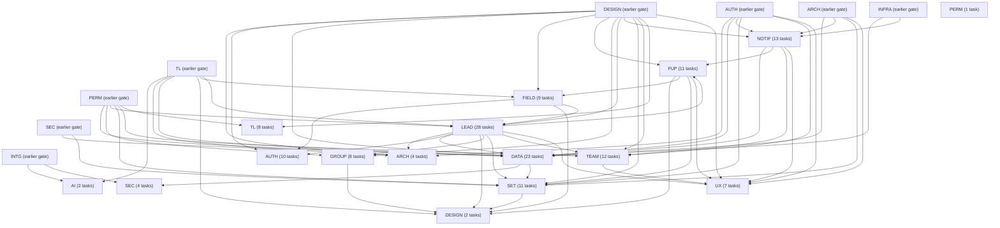

## AI

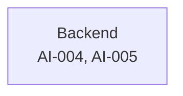

| ID | Title | Track | Size | Depends On | Spec Refs |
|---|---|---|---|---|---|
| TASK-AI-004 | Implement V1 write-time capture fields that cannot be backfilled | backend | L | TASK-TL-001, TASK-INTG-001 | SN-AI-002, SN-AI-011, SN-AI-012, SN-AI-013, SN-AI-014 |
| TASK-AI-005 | Implement AI-output labelling and correction-event recording | backend | M | TASK-TL-001 | SN-AI-023 |

## ARCH

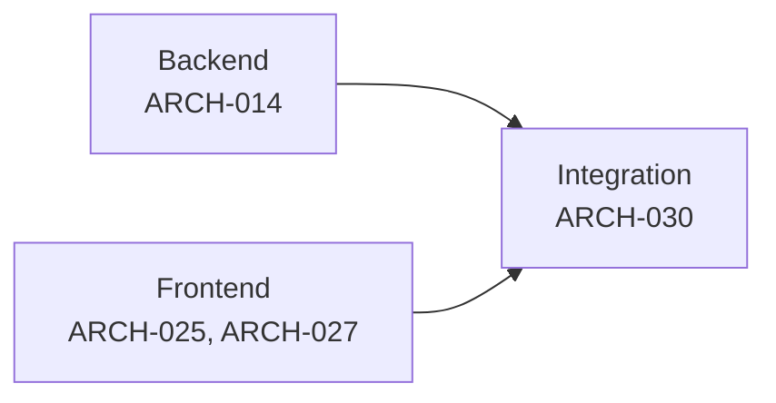

| ID | Title | Track | Size | Depends On | Spec Refs |
|---|---|---|---|---|---|
| TASK-ARCH-014 | Implement SSE real-time channel infrastructure | backend | M | TASK-AUTH-002, TASK-TL-002, TASK-TL-004 | SN-ARCH-014, SN-TL-026 |
| TASK-ARCH-025 | Build global search UI (Cmd+K / Ctrl+K) | frontend | M | TASK-ARCH-006 | SN-ARCH-015, SN-ARCH-104 |
| TASK-ARCH-027 | Build lead detail screen layout scaffold | frontend | M | TASK-ARCH-021, TASK-DESIGN-005, TASK-LEAD-004, TASK-TL-003 | SN-ARCH-030, SN-ARCH-102 |
| TASK-ARCH-030 | Integrate SSE real-time channel into the frontend end-to-end | qa | S | TASK-ARCH-014, TASK-ARCH-021 | SN-ARCH-014 |

## AUTH

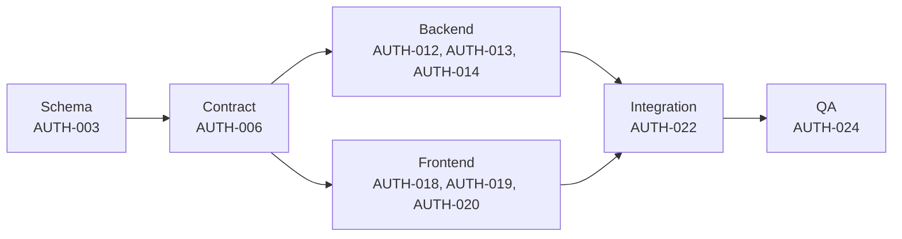

| ID | Title | Track | Size | Depends On | Spec Refs |
|---|---|---|---|---|---|
| TASK-AUTH-003 | Create onboarding & activation schema | backend | M | - | SN-AUTH-030..033, SN-AUTH-040..042, SN-AUTH-050 |
| TASK-AUTH-006 | Define onboarding/activation/banner route contracts | backend | M | TASK-AUTH-003 | SN-AUTH-030..033, SN-AUTH-040..042, SN-AUTH-050 |
| TASK-AUTH-012 | Implement server-driven onboarding sequence engine and industry seeding | backend | M | TASK-AUTH-006, TASK-FIELD-001 | SN-AUTH-030..033 |
| TASK-AUTH-013 | Implement activation checklist derivation logic | backend | M | TASK-AUTH-006, TASK-AUTH-002, TASK-LEAD-001 | SN-AUTH-040..042 |
| TASK-AUTH-014 | Implement bootstrap.warnings banner producer framework | backend | S | TASK-AUTH-006 | SN-AUTH-050 |
| TASK-AUTH-018 | Build data-driven onboarding screen renderer | frontend | M | TASK-AUTH-006, TASK-DESIGN-003 | SN-AUTH-030..033 |
| TASK-AUTH-019 | Build activation checklist widget | frontend | S | TASK-AUTH-006 | SN-AUTH-040..042 |
| TASK-AUTH-020 | Build global banner component | frontend | S | TASK-AUTH-006 | SN-AUTH-050 |
| TASK-AUTH-022 | Integrate onboarding/activation/banners end-to-end | qa | M | TASK-AUTH-012, TASK-AUTH-013, TASK-AUTH-014, TASK-AUTH-018, TASK-AUTH-019, TASK-AUTH-020, TASK-FIELD-003 | SN-AUTH-030..033, SN-AUTH-040..042, SN-AUTH-050 |
| TASK-AUTH-024 | QA: verify onboarding/activation/banners | qa | S | TASK-AUTH-022 | SN-AUTH-030..033, SN-AUTH-040..042, SN-AUTH-050 |

## DATA

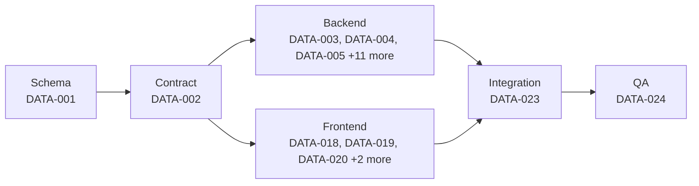

| ID | Title | Track | Size | Depends On | Spec Refs |
|---|---|---|---|---|---|
| TASK-DATA-001 | Create import/export/deletion schema (migrations + models + constraints) | backend | M | TASK-LEAD-001, TASK-AUTH-002 | SN-DATA-001, SN-DATA-002, SN-DATA-007, SN-DATA-011, SN-DATA-012, SN-DATA-014, SN-DATA-020, SN-SEC-003 |
| TASK-DATA-002 | Define import/export/deletion API contract, validation, policies and generated types | backend | M | TASK-DATA-001, TASK-ARCH-004, TASK-PERM-003 | SN-DATA-001..003, SN-DATA-010, SN-DATA-012, SN-DATA-013, SN-DATA-016, SN-DATA-017, SN-DATA-020, SN-DATA-021 |
| TASK-DATA-003 | Implement CSV/XLSX upload parsing and auto-suggested, remembered column mapping | backend | M | TASK-DATA-002 | SN-DATA-001, SN-DATA-002 |
| TASK-DATA-004 | Implement transformation-accurate import preview | backend | S | TASK-DATA-002, TASK-DATA-003 | SN-DATA-003 |
| TASK-DATA-005 | Implement async import execution engine with partial-success and error-CSV export | backend | L | TASK-DATA-002, TASK-DATA-003, TASK-DATA-004, TASK-DATA-006, TASK-DATA-007, TASK-INFRA-004 | SN-DATA-004, SN-ARCH-011 |
| TASK-DATA-006 | Implement per-import duplicate policy application and merge/creation reporting | backend | S | TASK-DATA-002, TASK-LEAD-012 | SN-DATA-005, SN-LEAD-050, SN-LEAD-051 |
| TASK-DATA-007 | Suppress notifications, routing, sequence enrolment and first_response_at for imported leads | backend | S | TASK-DATA-002, TASK-NOTIF-003 | SN-DATA-006, SN-WA-025 |
| TASK-DATA-008 | Implement import batch tagging and 7-day undo | backend | M | TASK-DATA-002, TASK-DATA-005 | SN-DATA-007 |
| TASK-DATA-009 | Implement guided phone-contact (vCard) import flow | backend | S | TASK-DATA-002 | SN-DATA-008, SN-WA-023 |
| TASK-DATA-010 | Implement export generation engine for all export types and formats | backend | M | TASK-DATA-002, TASK-TL-002 | SN-DATA-011, SN-TL-026 |
| TASK-DATA-011 | Implement async export job with signed, session-authenticated 24h download link | backend | M | TASK-DATA-002, TASK-DATA-010, TASK-INFRA-004 | SN-DATA-012, SN-ARCH-011 |
| TASK-DATA-012 | Enforce permission-scoped export queries | backend | S | TASK-DATA-002, TASK-DATA-010, TASK-PERM-003 | SN-DATA-013 |
| TASK-DATA-013 | Implement export audit logging and large-export owner notification | backend | S | TASK-DATA-002, TASK-DATA-010, TASK-DATA-011, TASK-SEC-003, TASK-ARCH-020 | SN-DATA-014, SN-DATA-015, SN-SEC-010, SN-SEC-011 |
| TASK-DATA-014 | Implement export rate limiting | backend | S | TASK-DATA-002, TASK-DATA-010, TASK-SEC-006 | SN-DATA-016, SN-SEC-008 |
| TASK-DATA-015 | Implement plan-based row-limit truncation with visible reporting | backend | S | TASK-DATA-002, TASK-DATA-010, TASK-PERM-002 | SN-DATA-017 |
| TASK-DATA-016 | Implement self-serve account deletion with 30-day grace period | backend | M | TASK-DATA-002, TASK-DATA-010, TASK-SEC-025 | SN-DATA-020..022 |
| TASK-DATA-018 | Build the five-step import wizard UI | frontend | L | TASK-DATA-002, TASK-DESIGN-005, TASK-DESIGN-006 | SN-DATA-001..004 |
| TASK-DATA-019 | Build import batch history and undo UI | frontend | S | TASK-DATA-002, TASK-DESIGN-006 | SN-DATA-007 |
| TASK-DATA-020 | Build guided phone-contact (vCard) import UI | frontend | S | TASK-DATA-002, TASK-DESIGN-005 | SN-DATA-008, SN-WA-023 |
| TASK-DATA-021 | Build export request UI across all scopes and formats | frontend | M | TASK-DATA-002, TASK-DESIGN-003, TASK-DESIGN-004 | SN-DATA-011..017 |
| TASK-DATA-022 | Build account deletion and lead-erasure settings UI | frontend | S | TASK-DATA-002, TASK-DESIGN-005, TASK-DESIGN-003, TASK-DESIGN-004 | SN-DATA-020..023 |
| TASK-DATA-023 | Integrate import/export/deletion frontend with live backend end-to-end | qa | L | TASK-DATA-003, TASK-DATA-004, TASK-DATA-005, TASK-DATA-006, TASK-DATA-007, TASK-DATA-008, TASK-DATA-009, TASK-DATA-010, TASK-DATA-011, TASK-DATA-012, TASK-DATA-013, TASK-DATA-014, TASK-DATA-015, TASK-DATA-016, TASK-DATA-018, TASK-DATA-019, TASK-DATA-020, TASK-DATA-021, TASK-DATA-022, TASK-SEC-021 | SN-DATA-004, SN-DATA-007, SN-DATA-012, SN-DATA-020 |
| TASK-DATA-024 | QA import/export/deletion acceptance criteria | qa | M | TASK-DATA-023 | SN-DATA-004, SN-DATA-006, SN-DATA-007, SN-DATA-014..017, SN-DATA-020..023 |

## DESIGN

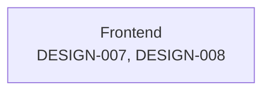

| ID | Title | Track | Size | Depends On | Spec Refs |
|---|---|---|---|---|---|
| TASK-DESIGN-007 | Implement the ContactActionBar domain component | frontend | M | TASK-DESIGN-002, TASK-DESIGN-004, TASK-LEAD-004, TASK-SET-002 | SN-DS-033, SN-SET-020 |
| TASK-DESIGN-008 | Implement Core Loop domain components (LeadCard, LeadListRow, StageBadge, GroupChip, FollowUpPill, TimelineEvent) | frontend | M | TASK-DESIGN-002, TASK-DESIGN-004, TASK-DESIGN-005, TASK-LEAD-004, TASK-FIELD-002, TASK-GROUP-002, TASK-FUP-002, TASK-TL-003 | SN-DS-030 |

## FIELD

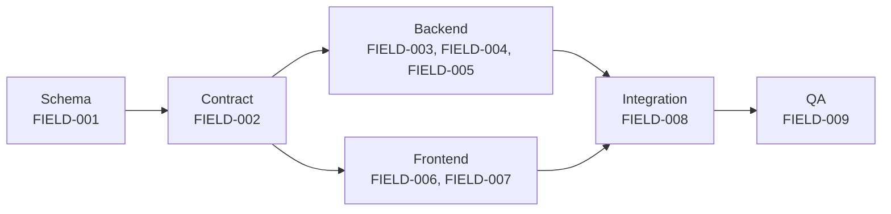

| ID | Title | Track | Size | Depends On | Spec Refs |
|---|---|---|---|---|---|
| TASK-FIELD-001 | Create custom field & lead-stage schema | backend | M | - | SN-FIELD-001..004, SN-FIELD-007, SN-FIELD-020, SN-FIELD-022, SN-FIELD-023, SN-FIELD-024 |
| TASK-FIELD-002 | Define custom field & stage route contracts | backend | M | TASK-FIELD-001 | SN-FIELD-001..009, SN-FIELD-020, SN-FIELD-021 |
| TASK-FIELD-003 | Implement field CRUD and typed-storage logic | backend | M | TASK-FIELD-002 | SN-FIELD-001..004, SN-FIELD-009 |
| TASK-FIELD-004 | Implement autofill mapping and date-field reminder logic | backend | M | TASK-FIELD-002, TASK-FUP-003 | SN-FIELD-005, SN-FIELD-006 |
| TASK-FIELD-005 | Implement stage-history tracking and relative-move reordering | backend | M | TASK-FIELD-002, TASK-TL-004 | SN-FIELD-007, SN-FIELD-008, SN-FIELD-020, SN-FIELD-021 |
| TASK-FIELD-006 | Build custom fields settings UI | frontend | M | TASK-FIELD-002, TASK-DESIGN-005 | SN-FIELD-001..009 |
| TASK-FIELD-007 | Build lead-stage configuration UI | frontend | S | TASK-FIELD-002 | SN-FIELD-020, SN-FIELD-021 |
| TASK-FIELD-008 | Integrate custom fields & stage settings end-to-end | qa | M | TASK-FIELD-003, TASK-FIELD-004, TASK-FIELD-005, TASK-FIELD-006, TASK-FIELD-007 | SN-FIELD-001..009, SN-FIELD-020, SN-FIELD-021 |
| TASK-FIELD-009 | QA: verify custom fields and stage behaviour | qa | S | TASK-FIELD-008 | SN-FIELD-001..009 |

## FUP

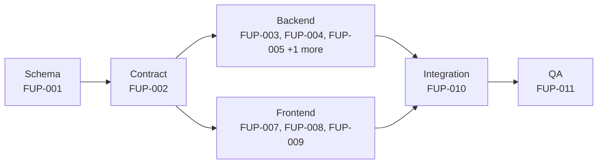

| ID | Title | Track | Size | Depends On | Spec Refs |
|---|---|---|---|---|---|
| TASK-FUP-001 | Create follow-up schema | backend | S | - | SN-FUP-001, SN-FUP-003, SN-FUP-012, SN-FUP-013, SN-FUP-033 |
| TASK-FUP-002 | Define follow-up route contracts | backend | M | TASK-FUP-001 | SN-FUP-001, SN-FUP-002, SN-FUP-010, SN-FUP-020..024 |
| TASK-FUP-003 | Implement follow-up set/complete/snooze logic | backend | M | TASK-FUP-002 | SN-FUP-001, SN-FUP-010, SN-FUP-022, SN-FUP-023 |
| TASK-FUP-004 | Implement bucket derivation and timezone logic | backend | M | TASK-FUP-002 | SN-FUP-002, SN-FUP-004, SN-FUP-020, SN-FUP-021 |
| TASK-FUP-005 | Implement auto-follow-up and reassignment logic | backend | M | TASK-FUP-002, TASK-LEAD-010, TASK-LEAD-011 | SN-FUP-011, SN-FUP-013 |
| TASK-FUP-006 | Implement follow-up reminders and quiet-hours logic | backend | M | TASK-FUP-002, TASK-NOTIF-006 | SN-FUP-030..032 |
| TASK-FUP-007 | Build follow-up list screen | frontend | M | TASK-FUP-002, TASK-DESIGN-013 | SN-FUP-020, SN-FUP-021 |
| TASK-FUP-008 | Build follow-up row actions and row content UI | frontend | M | TASK-FUP-002 | SN-FUP-022, SN-FUP-023, SN-FUP-024 |
| TASK-FUP-009 | Build follow-up quick-set UI | frontend | S | TASK-FUP-002, TASK-LEAD-020, TASK-LEAD-018 | SN-FUP-010 |
| TASK-FUP-010 | Integrate follow-ups end-to-end | qa | M | TASK-FUP-003, TASK-FUP-004, TASK-FUP-005, TASK-FUP-006, TASK-FUP-007, TASK-FUP-008, TASK-FUP-009 | SN-FUP-001..032 |
| TASK-FUP-011 | QA: verify follow-ups against acceptance criteria | qa | S | TASK-FUP-010 | SN-FUP-001..032 |

## GROUP

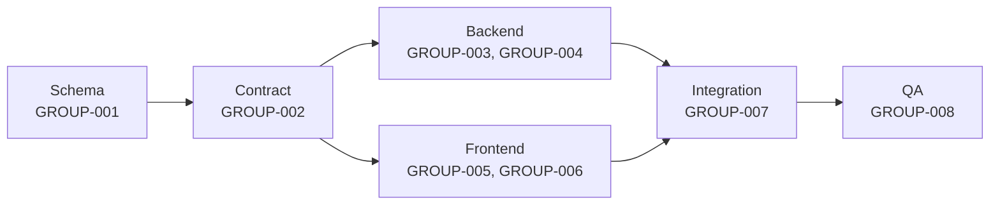

| ID | Title | Track | Size | Depends On | Spec Refs |
|---|---|---|---|---|---|
| TASK-GROUP-001 | Create groups schema | backend | S | - | SN-GROUP-001, SN-GROUP-002, SN-GROUP-006 |
| TASK-GROUP-002 | Define group route contracts | backend | S | TASK-GROUP-001 | SN-GROUP-001..005 |
| TASK-GROUP-003 | Implement group CRUD, merge and count logic | backend | M | TASK-GROUP-002, TASK-PERM-002 | SN-GROUP-001..004 |
| TASK-GROUP-004 | Expose group membership as an automation target | backend | S | TASK-GROUP-002 | SN-GROUP-005 |
| TASK-GROUP-005 | Build groups settings UI | frontend | S | TASK-GROUP-002, TASK-DESIGN-003 | SN-GROUP-001..004 |
| TASK-GROUP-006 | Build inline group assignment UI | frontend | S | TASK-GROUP-002, TASK-LEAD-018 | SN-GROUP-001, SN-GROUP-002 |
| TASK-GROUP-007 | Integrate groups end-to-end | qa | S | TASK-GROUP-003, TASK-GROUP-004, TASK-GROUP-005, TASK-GROUP-006 | SN-GROUP-001..005 |
| TASK-GROUP-008 | QA: verify groups behaviour | qa | S | TASK-GROUP-007 | SN-GROUP-001..005 |

## LEAD

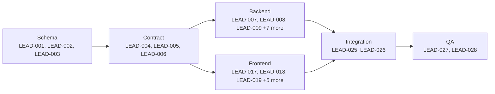

| ID | Title | Track | Size | Depends On | Spec Refs |
|---|---|---|---|---|---|
| TASK-LEAD-001 | Create lead core schema | backend | M | - | SN-LEAD-001..005, SN-LEAD-083, SN-ARCH-111 |
| TASK-LEAD-002 | Create duplicate-detection & merge schema | backend | M | TASK-LEAD-001 | SN-LEAD-050, SN-LEAD-051, SN-LEAD-052 |
| TASK-LEAD-003 | Create bulk/import/export/saved-view schema | backend | M | TASK-LEAD-001 | SN-LEAD-011, SN-LEAD-013, SN-LEAD-060..072 |
| TASK-LEAD-004 | Define lead query, detail and inline-edit route contracts | backend | M | TASK-LEAD-001 | SN-LEAD-010..014, SN-LEAD-020..024, SN-LEAD-080..082 |
| TASK-LEAD-005 | Define assignment, duplicate-review and merge route contracts | backend | M | TASK-LEAD-001, TASK-LEAD-002 | SN-LEAD-030..032, SN-LEAD-050..052 |
| TASK-LEAD-006 | Define bulk/import/export route contracts | backend | M | TASK-LEAD-003 | SN-LEAD-060..072 |
| TASK-LEAD-007 | Implement lead CRUD, phone parsing and contactability validation | backend | M | TASK-LEAD-004 | SN-LEAD-001..005 |
| TASK-LEAD-008 | Implement unified list/query engine (table+grid+views+search) | backend | L | TASK-LEAD-004 | SN-LEAD-010..013, SN-LEAD-080..082 |
| TASK-LEAD-009 | Implement dwell-gated interaction logging and time-in-stage | backend | S | TASK-LEAD-004, TASK-FIELD-001 | SN-LEAD-021, SN-LEAD-023, SN-LEAD-024 |
| TASK-LEAD-010 | Implement assignment logic | backend | M | TASK-LEAD-005, TASK-TL-004, TASK-PERM-002 | SN-LEAD-030..032 |
| TASK-LEAD-011 | Implement contacted-state derivation and first-response stamping | backend | M | TASK-LEAD-004, TASK-TL-004 | SN-LEAD-040..042 |
| TASK-LEAD-012 | Implement duplicate-detection engine | backend | M | TASK-LEAD-005 | SN-LEAD-050, SN-LEAD-051 |
| TASK-LEAD-013 | Implement merge engine with 30-day undo | backend | L | TASK-LEAD-005 | SN-LEAD-052 |
| TASK-LEAD-014 | Implement bulk operations engine (preview, partial success, filter selection) | backend | M | TASK-LEAD-006 | SN-LEAD-060..063 |
| TASK-LEAD-015 | Implement CSV import engine with per-row errors and 7-day undo | backend | L | TASK-LEAD-006, TASK-FIELD-001 | SN-LEAD-070, SN-LEAD-071 |
| TASK-LEAD-016 | Implement export engine | backend | S | TASK-LEAD-006, TASK-PERM-002 | SN-LEAD-072 |
| TASK-LEAD-017 | Build lead table view | frontend | M | TASK-LEAD-004, TASK-DESIGN-007 | SN-LEAD-010, SN-LEAD-020 |
| TASK-LEAD-018 | Build lead grid view with independent inline editing | frontend | M | TASK-LEAD-004, TASK-DESIGN-006 | SN-LEAD-010, SN-LEAD-013, SN-LEAD-014 |
| TASK-LEAD-019 | Build saved views and filter UI | frontend | M | TASK-LEAD-004 | SN-LEAD-011, SN-LEAD-012, SN-LEAD-081, SN-LEAD-082 |
| TASK-LEAD-020 | Build lead detail screen | frontend | L | TASK-LEAD-004, TASK-TL-009, TASK-DESIGN-007 | SN-LEAD-020..024 |
| TASK-LEAD-021 | Build duplicate review and merge UI | frontend | M | TASK-LEAD-005 | SN-LEAD-050..052 |
| TASK-LEAD-022 | Build bulk action UI | frontend | M | TASK-LEAD-006 | SN-LEAD-060..063 |
| TASK-LEAD-023 | Build CSV import wizard UI | frontend | M | TASK-LEAD-006 | SN-LEAD-070, SN-LEAD-071 |
| TASK-LEAD-024 | Build export request UI | frontend | S | TASK-LEAD-006 | SN-LEAD-072 |
| TASK-LEAD-025 | Integrate lead list/detail/assignment/contacted-state end-to-end | qa | L | TASK-LEAD-007, TASK-LEAD-008, TASK-LEAD-009, TASK-LEAD-010, TASK-LEAD-011, TASK-LEAD-017, TASK-LEAD-018, TASK-LEAD-019, TASK-LEAD-020 | SN-LEAD-010..014, SN-LEAD-020..024, SN-LEAD-030..032, SN-LEAD-040..042 |
| TASK-LEAD-026 | Integrate duplicate/merge/bulk/import/export end-to-end | qa | L | TASK-LEAD-012, TASK-LEAD-013, TASK-LEAD-014, TASK-LEAD-015, TASK-LEAD-016, TASK-LEAD-021, TASK-LEAD-022, TASK-LEAD-023, TASK-LEAD-024 | SN-LEAD-050..052, SN-LEAD-060..072 |
| TASK-LEAD-027 | QA: verify lead model/list/detail/assignment/contacted-state | qa | M | TASK-LEAD-025 | SN-LEAD-001..042 |
| TASK-LEAD-028 | QA: verify duplicate/merge/bulk/import/export | qa | S | TASK-LEAD-026 | SN-LEAD-050..072 |

## NOTIF

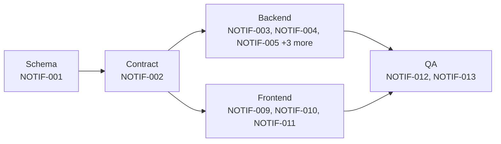

| ID | Title | Track | Size | Depends On | Spec Refs |
|---|---|---|---|---|---|
| TASK-NOTIF-001 | Migrate schema for notifications, preferences and push subscriptions | backend | M | TASK-INFRA-004, TASK-AUTH-002 | SN-NOTIF-011, SN-NOTIF-040, SN-NOTIF-041, SN-NOTIF-042, SN-NOTIF-043, SN-NOTIF-051, SN-NOTIF-023 |
| TASK-NOTIF-002 | Define notification preferences, push and in-app centre API contracts | backend | M | TASK-NOTIF-001, TASK-ARCH-004 | SN-NOTIF-022, SN-NOTIF-030, SN-NOTIF-031, SN-NOTIF-032 |
| TASK-NOTIF-003 | Implement real-time delivery pipeline with dedupe and grouping | backend | M | TASK-NOTIF-001, TASK-NOTIF-002, TASK-INFRA-004 | SN-NOTIF-002, SN-NOTIF-040, SN-NOTIF-041 |
| TASK-NOTIF-004 | Implement quiet hours and digest scheduling engine | backend | M | TASK-NOTIF-001, TASK-NOTIF-002, TASK-INFRA-004 | SN-NOTIF-003, SN-NOTIF-004, SN-NOTIF-011 |
| TASK-NOTIF-005 | Implement notification catalogue, deep-link routing and content redaction | backend | M | TASK-NOTIF-001, TASK-NOTIF-002 | SN-NOTIF-001, SN-NOTIF-005, SN-NOTIF-010, SN-NOTIF-032, SN-NOTIF-043 |
| TASK-NOTIF-006 | Implement channel delivery adapters (web push, email fallback, sender identity) | backend | M | TASK-NOTIF-001, TASK-NOTIF-002 | SN-NOTIF-020, SN-NOTIF-021, SN-NOTIF-050, SN-NOTIF-051, SN-NOTIF-052 |
| TASK-NOTIF-007 | Implement in-app notification centre backend | backend | S | TASK-NOTIF-001, TASK-NOTIF-002 | SN-NOTIF-022 |
| TASK-NOTIF-008 | Implement channel failure monitoring | backend | S | TASK-NOTIF-001 | SN-NOTIF-042 |
| TASK-NOTIF-009 | Build notification preferences matrix UI | frontend | M | TASK-NOTIF-002, TASK-DESIGN-006 | SN-NOTIF-030, SN-NOTIF-031, SN-NOTIF-032 |
| TASK-NOTIF-010 | Build web push contextual prompt and in-app notification centre UI | frontend | M | TASK-NOTIF-002, TASK-DESIGN-004 | SN-NOTIF-020, SN-NOTIF-022 |
| TASK-NOTIF-011 | Build notification deep-link handling | frontend | S | TASK-NOTIF-002 | SN-NOTIF-001 |
| TASK-NOTIF-012 | Integrate notification frontend with live delivery pipeline | qa | M | TASK-NOTIF-003, TASK-NOTIF-004, TASK-NOTIF-005, TASK-NOTIF-006, TASK-NOTIF-007, TASK-NOTIF-009, TASK-NOTIF-010, TASK-NOTIF-011 | SN-NOTIF-002, SN-NOTIF-003, SN-NOTIF-040, SN-NOTIF-041 |
| TASK-NOTIF-013 | QA verification of notifications acceptance criteria | qa | S | TASK-NOTIF-012 | SN-NOTIF-002, SN-NOTIF-003, SN-NOTIF-032, SN-NOTIF-041, SN-NOTIF-043 |

## PERM

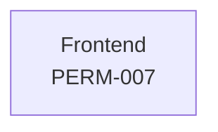

| ID | Title | Track | Size | Depends On | Spec Refs |
|---|---|---|---|---|---|
| TASK-PERM-007 | Build capability-grid and role-preset management UI | frontend | M | TASK-PERM-002 | SN-PERM-001, SN-PERM-002, SN-PERM-004 |

## SEC

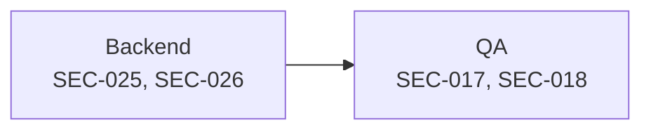

| ID | Title | Track | Size | Depends On | Spec Refs |
|---|---|---|---|---|---|
| TASK-SEC-017 | Integrate audit-log viewer and bulk-export controls end to end | qa | M | TASK-SEC-003, TASK-SEC-004, TASK-SEC-006, TASK-SEC-016, TASK-DATA-013, TASK-DATA-014 | SN-SEC-010, SN-SEC-011 |
| TASK-SEC-018 | Verify security control suite against section-3 acceptance bar | qa | M | TASK-SEC-017 | SN-SEC-001..015, SN-COMP-006 |
| TASK-SEC-025 | Implement scheduled data-retention enforcement jobs | backend | M | TASK-SEC-019, TASK-DATA-005, TASK-DATA-011, TASK-INTG-001, TASK-INTG-007 | SN-PRIV-004 |
| TASK-SEC-026 | Implement breach-impact determination tool | backend | M | TASK-SEC-019, TASK-SEC-025 | SN-COMP-004, SN-COMP-013 |

## SET

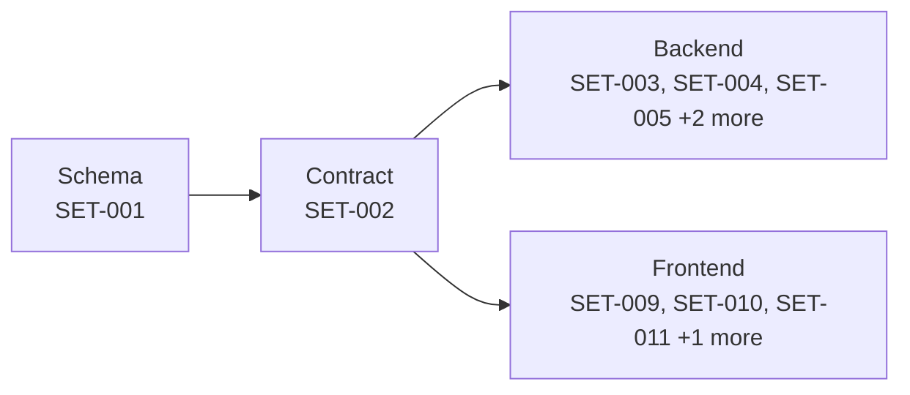

| ID | Title | Track | Size | Depends On | Spec Refs |
|---|---|---|---|---|---|
| TASK-SET-001 | Migrate schema for user/org settings, admin locks and branding | backend | M | TASK-SEC-001, TASK-AUTH-002 | SN-SET-002, SN-SET-003, SN-SET-020, SN-SET-021, SN-SET-030, SN-SET-031, SN-SET-032, SN-SET-062, SN-SET-001 |
| TASK-SET-002 | Define settings, profile, branding and security API contracts | backend | M | TASK-SET-001, TASK-ARCH-004, TASK-ARCH-013, TASK-AUTH-007, TASK-AUTH-001 | SN-SET-003, SN-SET-010, SN-SET-011, SN-SET-030, SN-SET-031, SN-SET-032, SN-SET-040, SN-SET-041, SN-SET-050, SN-SET-051, SN-SET-052, SN-SET-060, SN-SET-061, SN-SET-063 |
| TASK-SET-003 | Implement user preferences write path and admin lock enforcement | backend | M | TASK-SET-001, TASK-SET-002, TASK-FUP-002 | SN-SET-002, SN-SET-003, SN-SET-020, SN-SET-021, SN-SET-060, SN-SET-061, SN-SET-062 |
| TASK-SET-004 | Implement profile management and email-change OTP flow | backend | S | TASK-SET-001, TASK-SET-002, TASK-AUTH-007 | SN-SET-010, SN-SET-011 |
| TASK-SET-005 | Implement org lead-settings logic (duplicate policy, unmark triggers, badge sources) | backend | M | TASK-SET-001, TASK-SET-002, TASK-LEAD-012 | SN-SET-030, SN-SET-031, SN-SET-032 |
| TASK-SET-007 | Implement security settings backend (sessions, audit log, data export/deletion) | backend | M | TASK-SET-001, TASK-SET-002, TASK-SEC-002, TASK-DATA-010, TASK-DATA-016, TASK-AUTH-008, TASK-PERM-002 | SN-SET-050, SN-SET-051, SN-SET-052 |
| TASK-SET-008 | Implement bootstrap settings payload assembly and org-setting audit logging | backend | S | TASK-SET-001, TASK-SET-002, TASK-ARCH-013 | SN-SET-060, SN-SET-063 |
| TASK-SET-009 | Build profile and security settings UI | frontend | M | TASK-SET-002, TASK-DESIGN-003, TASK-DESIGN-006 | SN-SET-010, SN-SET-011, SN-SET-050, SN-SET-051, SN-SET-052 |
| TASK-SET-010 | Build personalisation preferences UI | frontend | M | TASK-SET-002, TASK-DESIGN-003, TASK-DESIGN-006 | SN-SET-020, SN-SET-021, SN-SET-003, SN-SET-061 |
| TASK-SET-011 | Build org lead-settings UI | frontend | S | TASK-SET-002, TASK-DESIGN-003 | SN-SET-030, SN-SET-031, SN-SET-032 |
| TASK-SET-013 | Build settings screen tree navigation, data export/deletion UI | frontend | M | TASK-SET-002, TASK-DATA-021, TASK-DATA-022, TASK-DESIGN-013 | SN-SET-052 |

## TEAM

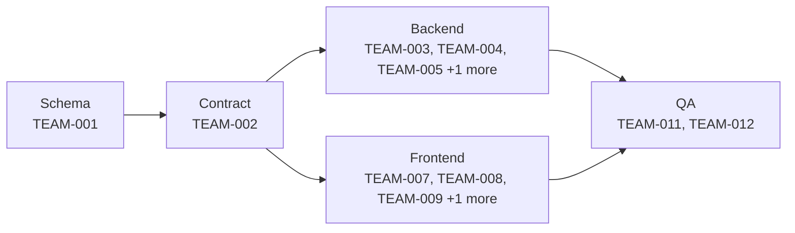

| ID | Title | Track | Size | Depends On | Spec Refs |
|---|---|---|---|---|---|
| TASK-TEAM-001 | Migrate schema for sub-teams, invitation lifecycle and escalation config | backend | M | TASK-AUTH-002, TASK-PERM-002 | SN-TEAM-003, SN-TEAM-004, SN-TEAM-010..013, SN-TEAM-030, SN-TEAM-031, SN-TEAM-032 |
| TASK-TEAM-002 | Define members, sub-teams, dashboard and escalation API contracts | backend | M | TASK-TEAM-001, TASK-PERM-002 | SN-TEAM-001, SN-TEAM-002, SN-TEAM-003, SN-TEAM-005, SN-TEAM-006, SN-TEAM-007, SN-TEAM-013, SN-TEAM-022, SN-TEAM-023, SN-TEAM-025, SN-TEAM-030 |
| TASK-TEAM-003 | Implement member invitation and lifecycle logic | backend | M | TASK-TEAM-002 | SN-TEAM-001, SN-TEAM-002, SN-TEAM-003, SN-TEAM-004, SN-TEAM-007 |
| TASK-TEAM-004 | Implement sub-team management and scoping logic | backend | M | TASK-TEAM-002, TASK-LEAD-004 | SN-TEAM-010, SN-TEAM-011, SN-TEAM-012, SN-TEAM-013 |
| TASK-TEAM-005 | Implement team dashboard aggregation and escalation-adjacent metrics | backend | M | TASK-TEAM-002, TASK-TEAM-004 | SN-TEAM-020, SN-TEAM-021, SN-TEAM-022, SN-TEAM-023, SN-TEAM-024, SN-TEAM-025 |
| TASK-TEAM-006 | Implement lead escalation sweep job | backend | S | TASK-TEAM-001, TASK-TEAM-002, TASK-NOTIF-004 | SN-TEAM-030, SN-TEAM-031 |
| TASK-TEAM-007 | Build members list and invite UI | frontend | M | TASK-TEAM-002, TASK-PERM-007, TASK-DESIGN-003, TASK-DESIGN-006 | SN-TEAM-001, SN-TEAM-002, SN-TEAM-003, SN-TEAM-004, SN-TEAM-005, SN-TEAM-006, SN-TEAM-007 |
| TASK-TEAM-008 | Build sub-teams management UI | frontend | S | TASK-TEAM-002, TASK-DESIGN-003, TASK-DESIGN-006 | SN-TEAM-010, SN-TEAM-011, SN-TEAM-012, SN-TEAM-013 |
| TASK-TEAM-009 | Build team dashboard UI | frontend | M | TASK-TEAM-002, TASK-DESIGN-006, TASK-DESIGN-022 | SN-TEAM-020, SN-TEAM-021, SN-TEAM-022, SN-TEAM-023, SN-TEAM-024, SN-TEAM-025 |
| TASK-TEAM-010 | Build lead escalation settings UI | frontend | S | TASK-TEAM-002, TASK-DESIGN-003 | SN-TEAM-030, SN-TEAM-031 |
| TASK-TEAM-011 | Integrate team & sub-team frontend with live backend | qa | M | TASK-TEAM-003, TASK-TEAM-004, TASK-TEAM-005, TASK-TEAM-006, TASK-TEAM-007, TASK-TEAM-008, TASK-TEAM-009, TASK-TEAM-010 | SN-TEAM-001..007, SN-TEAM-010..013, SN-TEAM-020..025, SN-TEAM-030, SN-TEAM-031 |
| TASK-TEAM-012 | QA verification of team & sub-teams acceptance criteria | qa | S | TASK-TEAM-011 | SN-TEAM-004, SN-TEAM-012, SN-TEAM-021, SN-TEAM-030 |

## TL

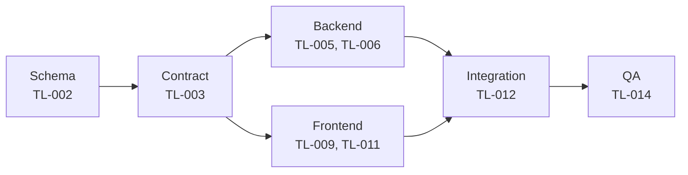

| ID | Title | Track | Size | Depends On | Spec Refs |
|---|---|---|---|---|---|
| TASK-TL-002 | Create timeline_event schema | backend | M | TASK-TL-001 | SN-TL-001..005, SN-TL-010..014, SN-TL-020, SN-TL-032 |
| TASK-TL-003 | Define timeline & activity-feed route contracts | backend | M | TASK-TL-002 | SN-TL-010..014, SN-TL-020..022, SN-TL-030, SN-TL-031 |
| TASK-TL-005 | Implement manual activity logging logic | backend | M | TASK-TL-003 | SN-TL-010..014, SN-TL-004 |
| TASK-TL-006 | Implement timeline read/query and permission-scoped org feed logic | backend | M | TASK-TL-003, TASK-PERM-003 | SN-TL-020..022, SN-TL-030, SN-TL-031 |
| TASK-TL-009 | Build lead timeline UI | frontend | L | TASK-TL-003, TASK-DESIGN-006 | SN-TL-004, SN-TL-010..014, SN-TL-020..022, SN-TL-025 |
| TASK-TL-011 | Build org-wide activity feed UI | frontend | M | TASK-TL-003 | SN-TL-030, SN-TL-031 |
| TASK-TL-012 | Integrate manual timeline and activity feed end-to-end | qa | L | TASK-TL-004, TASK-TL-005, TASK-TL-006, TASK-TL-009, TASK-TL-011 | SN-TL-001..005, SN-TL-010..014, SN-TL-020..022, SN-TL-030, SN-TL-031 |
| TASK-TL-014 | QA: verify manual timeline and activity-feed behaviour | qa | S | TASK-TL-012 | SN-TL-001..014, SN-TL-020..022, SN-TL-030, SN-TL-031 |

## UX

| ID | Title | Track | Size | Depends On | Spec Refs |
|---|---|---|---|---|---|
| TASK-UX-003 | Implement the signup-to-first-message onboarding flow UI (Flow 1) | frontend | L | TASK-DESIGN-002, TASK-DESIGN-003, TASK-DESIGN-004, TASK-DESIGN-005, TASK-DESIGN-007, TASK-ARCH-022, TASK-AUTH-008, TASK-LEAD-004, TASK-AUTH-004, TASK-AUTH-005, TASK-AUTH-006 | SN-UX-001 |
| TASK-UX-004 | Integrate the onboarding flow with live backend | qa | M | TASK-UX-003, TASK-AUTH-012, TASK-AUTH-013 | SN-UX-001 |
| TASK-UX-005 | QA Flow 1 against its budget | qa | S | TASK-UX-004 | SN-UX-001 |
| TASK-UX-006 | Implement the lead-arrival-to-first-response flow UI (Flow 2) | frontend | M | TASK-DESIGN-008, TASK-DESIGN-007, TASK-UX-002, TASK-ARCH-022, TASK-LEAD-004, TASK-NOTIF-002, TASK-TEAM-002 | SN-UX-002 |
| TASK-UX-015 | Implement the daily follow-up round flow UI (Flow 5) | frontend | M | TASK-DESIGN-008, TASK-ARCH-022, TASK-FUP-002, TASK-NOTIF-002 | SN-UX-005 |
| TASK-UX-016 | Integrate the follow-up queue flow with live backend | qa | S | TASK-UX-015, TASK-FUP-003, TASK-FUP-004, TASK-FUP-006 | SN-UX-005 |
| TASK-UX-017 | QA Flow 5 against its budget | qa | S | TASK-UX-016 | SN-UX-005 |

