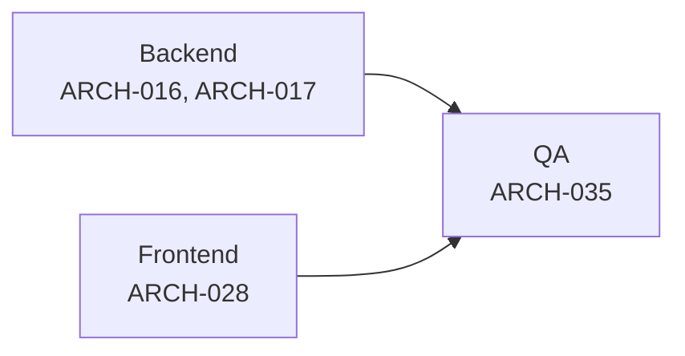
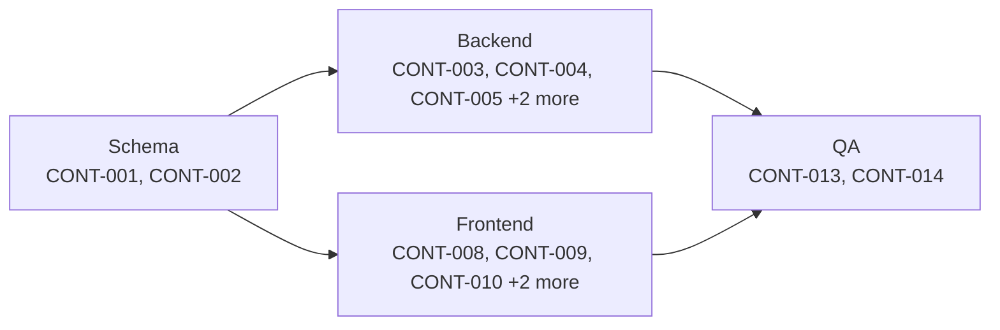
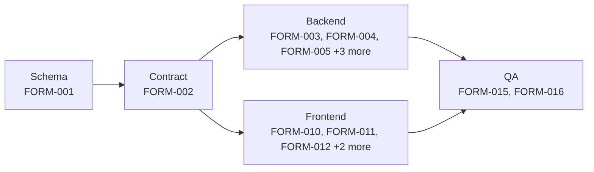
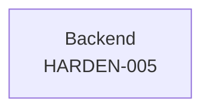
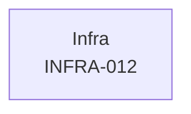
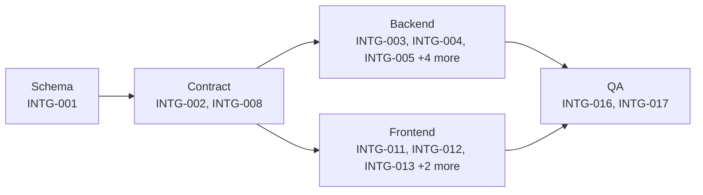
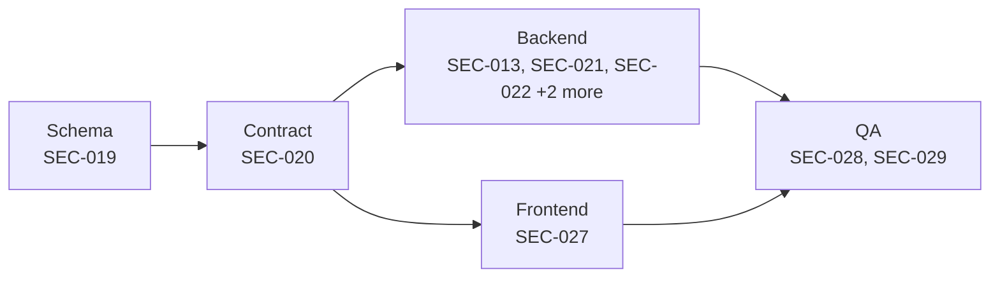
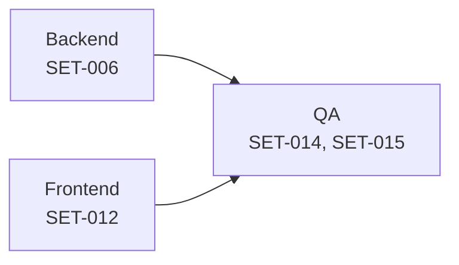
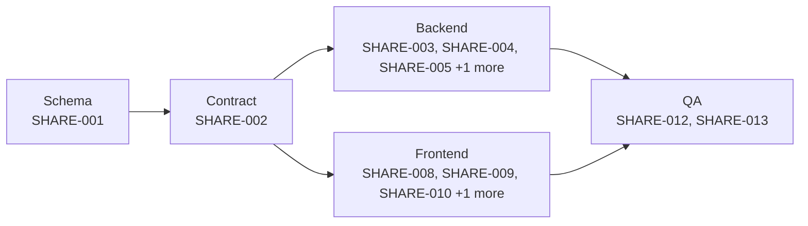

# G2 -- Acquisition & Content

**Scope:** integrations, forms, content, sharing. 86 tasks across 11 domains: ARCH, CONT, DESIGN, FORM, HARDEN, INFRA, INTG, SEC, SET, SHARE, UX.

> `gate` is a roadmap grouping label (see [`12-roadmap.md`](../12-roadmap.md)), not a scheduling dependency. The arrows below are real `depends_on` edges rolled up to domain level; each task's own row further down lists its precise dependencies.

## Domain-level dependency graph

```mermaid
flowchart TD
    AI_ext["AI (earlier gate)"]
    ARCH_ext["ARCH (earlier gate)"]
    AUTH_ext["AUTH (earlier gate)"]
    DATA_ext["DATA (earlier gate)"]
    DESIGN_ext["DESIGN (earlier gate)"]
    FIELD_ext["FIELD (earlier gate)"]
    INFRA_ext["INFRA (earlier gate)"]
    LEAD_ext["LEAD (earlier gate)"]
    PERM_ext["PERM (earlier gate)"]
    SEC_ext["SEC (earlier gate)"]
    SEQ_ext["SEQ (earlier gate)"]
    TL_ext["TL (earlier gate)"]
    ARCH["ARCH (4 tasks)"]
    CONT["CONT (14 tasks)"]
    DESIGN["DESIGN (2 tasks)"]
    FORM["FORM (15 tasks)"]
    HARDEN["HARDEN (1 task)"]
    INFRA["INFRA (1 task)"]
    INTG["INTG (17 tasks)"]
    SEC["SEC (10 tasks)"]
    SET["SET (4 tasks)"]
    SHARE["SHARE (12 tasks)"]
    UX["UX (6 tasks)"]
    AI_ext --> INTG
    ARCH_ext --> FORM
    ARCH_ext --> INTG
    ARCH_ext --> UX
    AUTH_ext --> ARCH
    AUTH_ext --> CONT
    AUTH_ext --> INTG
    AUTH_ext --> SHARE
    CONT --> DESIGN
    CONT --> SHARE
    CONT --> UX
    DATA_ext --> SEC
    DESIGN_ext --> CONT
    DESIGN_ext --> FORM
    DESIGN_ext --> INTG
    DESIGN_ext --> SEC
    DESIGN_ext --> SET
    DESIGN_ext --> SHARE
    DESIGN_ext --> UX
    FIELD_ext --> FORM
    FIELD_ext --> SEC
    FORM --> ARCH
    FORM --> SEC
    FORM --> SET
    INFRA_ext --> CONT
    INFRA_ext --> INTG
    INTG --> DESIGN
    INTG --> FORM
    INTG --> HARDEN
    INTG --> SEC
    LEAD_ext --> DESIGN
    LEAD_ext --> INTG
    LEAD_ext --> UX
    PERM_ext --> CONT
    SEC_ext --> CONT
    SEC_ext --> DESIGN
    SEC_ext --> FORM
    SEC_ext --> INTG
    SEQ_ext --> CONT
    SHARE --> ARCH
    SHARE --> DESIGN
    SHARE --> SEC
    SHARE --> SET
    SHARE --> UX
    TL_ext --> CONT
    UX --> DESIGN
```

## ARCH

| ID | Title | Track | Size | Depends On | Spec Refs |
|---|---|---|---|---|---|
| TASK-ARCH-016 | Migrate inbound_event ingestion log table | backend | S | TASK-AUTH-002 | SN-ARCH-041 |
| TASK-ARCH-017 | Implement generic webhook ingestion pipeline framework | backend | M | TASK-ARCH-004, TASK-ARCH-016 | SN-ARCH-041, SN-LEAD-060 |
| TASK-ARCH-028 | Scaffold public recipient-facing surface deployment | frontend | M | TASK-ARCH-004, TASK-SHARE-002, TASK-FORM-002 | SN-ARCH-030, SN-ARCH-100, SN-ARCH-095 |
| TASK-ARCH-035 | QA: verify webhook ingestion pipeline resilience | qa | S | TASK-ARCH-017 | SN-ARCH-041, SN-ARCH-096 |

## CONT

| ID | Title | Track | Size | Depends On | Spec Refs |
|---|---|---|---|---|---|
| TASK-CONT-001 | Schema: content base + message/file/page detail tables, folders, labels, shared-folder grants | backend | M | TASK-AUTH-002 | SN-CONT-001..006, SN-CONT-010, SN-CONT-020, SN-CONT-021, SN-CONT-023, SN-CONT-030, SN-CONT-032, SN-CONT-040, SN-CONT-041, SN-CONT-042, SN-CONT-044, SN-CONT-050, SN-CONT-051, SN-SEC-003, SN-CONT-052, SN-CONT-053, SN-CONT-054 |
| TASK-CONT-002 | Contract: content CRUD, token/page-template schema endpoints, file signing, search/filter API | backend | M | TASK-CONT-001, TASK-PERM-002 | SN-CONT-003, SN-CONT-006, SN-CONT-011, SN-CONT-012, SN-CONT-013, SN-CONT-021, SN-CONT-022, SN-CONT-031, SN-CONT-033, SN-CONT-034, SN-CONT-043, SN-CONT-055 |
| TASK-CONT-003 | Backend logic: message roles, render-time personalisation tokens, WhatsApp template authoring validation | backend | M | TASK-CONT-002, TASK-TL-004 | SN-CONT-010, SN-CONT-011, SN-CONT-012, SN-CONT-013 |
| TASK-CONT-004 | Backend logic: file upload/processing pipeline with S3 presign and five-state lifecycle | backend | M | TASK-CONT-002, TASK-INFRA-004, TASK-INFRA-005, TASK-SEC-012 | SN-CONT-020, SN-CONT-021, SN-CONT-022, SN-CONT-023, SN-ARCH-011 |
| TASK-CONT-005 | Backend logic: page block persistence, block-type registry, and per-page CTA resolution | backend | M | TASK-CONT-002 | SN-CONT-030, SN-CONT-031, SN-CONT-032, SN-CONT-033, SN-CONT-034 |
| TASK-CONT-006 | Backend logic: folders/labels taxonomy, search/filter, and engagement stats incl. TOTAL_UNOPENED | backend | M | TASK-CONT-002 | SN-CONT-002, SN-CONT-040, SN-CONT-041, SN-CONT-042, SN-CONT-043, SN-CONT-044 |
| TASK-CONT-007 | Backend logic: visibility promotion, copy-on-edit, archive/delete lifecycle, and shared-folder revocation | backend | M | TASK-CONT-002, TASK-SEQ-001 | SN-CONT-003, SN-CONT-004, SN-CONT-005, SN-CONT-006, SN-CONT-050, SN-CONT-051 |
| TASK-CONT-008 | Frontend: content library list, filters, and TOTAL_UNOPENED work-queue view | frontend | M | TASK-CONT-002, TASK-DESIGN-006 | SN-CONT-040, SN-CONT-041, SN-CONT-042, SN-CONT-043 |
| TASK-CONT-009 | Frontend: message editor with token picker, live preview, and inline WhatsApp-template validation | frontend | M | TASK-CONT-002, TASK-DESIGN-003 | SN-CONT-010, SN-CONT-011, SN-CONT-012, SN-CONT-013 |
| TASK-CONT-010 | Frontend: file upload widget with processing-state indicators and retry | frontend | M | TASK-CONT-002, TASK-DESIGN-004 | SN-CONT-020, SN-CONT-021, SN-CONT-022, SN-CONT-023 |
| TASK-CONT-011 | Frontend: page builder with server-driven block palette and mobile-width live preview | frontend | L | TASK-CONT-002, TASK-DESIGN-005 | SN-CONT-030, SN-CONT-031, SN-CONT-032, SN-CONT-033, SN-CONT-035 |
| TASK-CONT-012 | Frontend: visibility/copy-on-edit/archive-delete/shared-folder management UI | frontend | M | TASK-CONT-002, TASK-DESIGN-005 | SN-CONT-003, SN-CONT-004, SN-CONT-005, SN-CONT-006, SN-CONT-050, SN-CONT-051 |
| TASK-CONT-013 | Integration: wire content frontend to live backend end to end | qa | M | TASK-CONT-003, TASK-CONT-004, TASK-CONT-005, TASK-CONT-006, TASK-CONT-007, TASK-CONT-008, TASK-CONT-009, TASK-CONT-010, TASK-CONT-011, TASK-CONT-012 | SN-CONT-001..006, SN-CONT-050, SN-CONT-051 |
| TASK-CONT-014 | QA: verify content domain acceptance criteria | qa | S | TASK-CONT-013 | SN-CONT-005, SN-CONT-006, SN-CONT-011, SN-CONT-012, SN-CONT-020, SN-CONT-031 |

## DESIGN

| ID | Title | Track | Size | Depends On | Spec Refs |
|---|---|---|---|---|---|
| TASK-DESIGN-009 | Implement Acquisition & Content domain components (ContentCard, ShareSheet, ViewStatsRow) | frontend | M | TASK-DESIGN-002, TASK-DESIGN-004, TASK-DESIGN-005, TASK-CONT-002, TASK-SHARE-002 | SN-DS-030 |
| TASK-DESIGN-020 | Demonstrate the G2 acquisition & content gate exit criterion | qa | S | TASK-DESIGN-009, TASK-UX-014, TASK-LEAD-012, TASK-SHARE-005, TASK-SEC-013, TASK-INTG-017 | SN-LEAD-060 |

## FORM

| ID | Title | Track | Size | Depends On | Spec Refs |
|---|---|---|---|---|---|
| TASK-FORM-001 | Create lead form, field and submission schema with atomic creation support | backend | M | TASK-FIELD-001 | SN-FORM-001, SN-FORM-002, SN-FORM-010, SN-FORM-034 |
| TASK-FORM-002 | Define lead-forms API contract, metadata endpoint and validation rules | backend | M | TASK-FORM-001, TASK-ARCH-004 | SN-FORM-001, SN-FORM-003, SN-FORM-004, SN-FORM-005, SN-CONT-031, SN-LEAD-002 |
| TASK-FORM-003 | Implement form/field CRUD with invariant enforcement and atomic creation | backend | M | TASK-FORM-001, TASK-FORM-002 | SN-FORM-002, SN-FORM-003, SN-FORM-004, SN-FORM-005, SN-FORM-010 |
| TASK-FORM-004 | Implement post-submit configuration, branding and sharing (QR/embed/link) | backend | M | TASK-FORM-001, TASK-FORM-002 | SN-FORM-011, SN-FORM-012, SN-FORM-013 |
| TASK-FORM-005 | Implement public submission endpoint with preview enforcement and correct empty-state handling | backend | M | TASK-FORM-001, TASK-FORM-002, TASK-INTG-003 | SN-FORM-021, SN-FORM-030, SN-FORM-031 |
| TASK-FORM-006 | Implement public form anti-abuse layer | backend | M | TASK-FORM-005 | SN-FORM-022 |
| TASK-FORM-007 | Implement per-form analytics aggregation | backend | M | TASK-FORM-001, TASK-FORM-005 | SN-FORM-032 |
| TASK-FORM-009 | Implement form status lifecycle (DRAFT/ACTIVE/PAUSED/CLOSED) | backend | S | TASK-FORM-001, TASK-FORM-005 | SN-FORM-033 |
| TASK-FORM-010 | Build the form builder UI | frontend | M | TASK-FORM-002, TASK-DESIGN-003 | SN-FORM-001, SN-FORM-002, SN-FORM-003, SN-FORM-005 |
| TASK-FORM-011 | Build form settings UI: post-submit config, branding and sharing | frontend | M | TASK-FORM-002 | SN-FORM-011, SN-FORM-012, SN-FORM-013 |
| TASK-FORM-012 | Build the public form page as a separate, tracker-free deployment | frontend | L | TASK-FORM-002, TASK-SEC-020, TASK-ARCH-001, TASK-DESIGN-014 | SN-FORM-020, SN-FORM-021, SN-FORM-023, SN-FORM-024, SN-FORM-025, SN-SHARE-011 |
| TASK-FORM-013 | Build per-form analytics dashboard UI | frontend | S | TASK-FORM-002 | SN-FORM-032 |
| TASK-FORM-014 | Build form list and status management UI | frontend | S | TASK-FORM-002 | SN-FORM-033 |
| TASK-FORM-015 | Integrate lead-forms frontend with live backend end to end | qa | M | TASK-FORM-003, TASK-FORM-004, TASK-FORM-005, TASK-FORM-006, TASK-FORM-007, TASK-SEC-022, TASK-FORM-009, TASK-FORM-010, TASK-FORM-011, TASK-FORM-012, TASK-FORM-013, TASK-FORM-014 | SN-FORM-010, SN-FORM-030 |
| TASK-FORM-016 | QA verification of lead-forms acceptance criteria | qa | S | TASK-FORM-015 | SN-FORM-003, SN-FORM-010, SN-FORM-021, SN-FORM-022, SN-FORM-025, SN-FORM-031, SN-FORM-001 |

## HARDEN

| ID | Title | Track | Size | Depends On | Spec Refs |
|---|---|---|---|---|---|
| TASK-HARDEN-005 | Enforce non-2xx-on-failure webhook ingestion guarantee | backend | S | TASK-INTG-003 | SN-NFR-011 |

## INFRA

| ID | Title | Track | Size | Depends On | Spec Refs |
|---|---|---|---|---|---|
| TASK-INFRA-012 | Provision inbound email receiving infrastructure for lead-via-email ingestion | infra | S | TASK-INFRA-002 | SN-ARCH-003 |

## INTG

| ID | Title | Track | Size | Depends On | Spec Refs |
|---|---|---|---|---|---|
| TASK-INTG-001 | Create integration registry, connection and inbound_event schema | backend | M | TASK-AUTH-002, TASK-SEC-004 | SN-INTG-002, SN-INTG-003, SN-INTG-011..013, SN-SEC-003, SN-INTG-063, SN-INTG-064, SN-INTG-065 |
| TASK-INTG-002 | Define integrations API contract, requests, policies and generated types | backend | M | TASK-INTG-001, TASK-ARCH-004 | SN-INTG-001, SN-INTG-002, SN-INTG-003, SN-INTG-004, SN-INTG-060, SN-INTG-062 |
| TASK-INTG-003 | Implement the shared 9-step ingestion pipeline orchestrator | backend | L | TASK-INTG-001, TASK-INTG-002, TASK-LEAD-012, TASK-LEAD-013 | SN-INTG-010, SN-INTG-011, SN-INTG-012, SN-INTG-013, SN-INTG-014, SN-INTG-015, SN-INTG-016, SN-ARCH-011, SN-AI-010 |
| TASK-INTG-004 | Implement Facebook/Instagram Lead Ads connection lifecycle and token expiry handling | backend | M | TASK-INTG-001, TASK-INTG-002, TASK-INTG-003 | SN-INTG-020, SN-INTG-021, SN-INTG-022 |
| TASK-INTG-005 | Implement Facebook backfill, delayed-delivery detection and auto-tagging | backend | M | TASK-INTG-004 | SN-INTG-023, SN-INTG-024, SN-INTG-025 |
| TASK-INTG-006 | Implement remaining V1 integration parsers (WordPress, generic webhook, Zapier, LinkedIn, Google, TikTok) | backend | M | TASK-INTG-001, TASK-INTG-002, TASK-INTG-003 | SN-INTG-030, SN-INTG-031, SN-INTG-032 |
| TASK-INTG-007 | Implement lead-via-email ingestion with sender allowlist and raw retention | backend | M | TASK-INTG-001, TASK-INTG-003, TASK-INFRA-012 | SN-INTG-040, SN-INTG-043, SN-INTG-044, SN-SEC-010 |
| TASK-INTG-008 | Implement LLM extraction contract with per-field confidence and per-sender learned mapping | backend | M | TASK-INTG-007, TASK-AI-007, TASK-AI-013 | SN-INTG-041, SN-INTG-042, SN-AI-020 |
| TASK-INTG-009 | Implement WhatsApp-as-lead-source configuration hook | backend | S | TASK-INTG-001, TASK-INTG-002 | SN-INTG-050 |
| TASK-INTG-010 | Implement per-connection health monitoring, silence alerting and event replay | backend | M | TASK-INTG-001, TASK-INTG-002, TASK-INTG-003 | SN-INTG-060, SN-INTG-061, SN-INTG-062 |
| TASK-INTG-011 | Build integrations marketplace/list UI from server registry | frontend | M | TASK-INTG-002, TASK-DESIGN-003, TASK-DESIGN-004 | SN-INTG-001, SN-INTG-002, SN-INTG-003, SN-INTG-004 |
| TASK-INTG-012 | Build Facebook Lead Ads connection UI | frontend | M | TASK-INTG-002 | SN-INTG-020, SN-INTG-021, SN-INTG-022, SN-INTG-023, SN-INTG-024 |
| TASK-INTG-013 | Build connection UIs for WordPress, generic webhook and OAuth long-tail integrations | frontend | M | TASK-INTG-002 | SN-INTG-030, SN-INTG-031, SN-INTG-032 |
| TASK-INTG-014 | Build lead-via-email settings UI (allowlist, review queue, raw viewer) | frontend | M | TASK-INTG-002 | SN-INTG-040, SN-INTG-041, SN-INTG-042, SN-INTG-043, SN-INTG-044 |
| TASK-INTG-015 | Build integration health dashboard and staff replay UI | frontend | S | TASK-INTG-002 | SN-INTG-060, SN-INTG-061, SN-INTG-062 |
| TASK-INTG-016 | Integrate frontend integrations UI with live backend end to end | qa | M | TASK-INTG-003, TASK-INTG-004, TASK-INTG-005, TASK-INTG-006, TASK-INTG-007, TASK-INTG-008, TASK-INTG-009, TASK-INTG-010, TASK-INTG-011, TASK-INTG-012, TASK-INTG-013, TASK-INTG-014, TASK-INTG-015 | SN-INTG-010, SN-INTG-020, SN-INTG-031, SN-INTG-032, SN-INTG-040 |
| TASK-INTG-017 | QA verification of integrations acceptance criteria | qa | S | TASK-INTG-016 | SN-INTG-011, SN-INTG-013, SN-INTG-014, SN-INTG-021, SN-INTG-023 |

## SEC

| ID | Title | Track | Size | Depends On | Spec Refs |
|---|---|---|---|---|---|
| TASK-SEC-013 | Harden the public surface: opaque identifiers and data-minimisation posture | backend | M | TASK-FORM-012, TASK-SHARE-009 | SN-SEC-015, SN-PRIV-001 |
| TASK-SEC-019 | Create schema for consent, data-subject-request and retention tracking | backend | M | TASK-SEC-001 | SN-COMP-001, SN-COMP-003, SN-COMP-005, SN-DATA-023, SN-PRIV-004, SN-PRIV-005 |
| TASK-SEC-020 | Define consent-capture and data-subject-request API contract | backend | M | TASK-SEC-019 | SN-COMP-001, SN-COMP-003, SN-DATA-023, SN-PRIV-005 |
| TASK-SEC-021 | Implement cross-entity identifier search, correction and erasure for data-subject requests (incl. individual lead erasure) | backend | L | TASK-SEC-020, TASK-DATA-002, TASK-DATA-010 | SN-COMP-003, SN-COMP-012, SN-DATA-023 |
| TASK-SEC-022 | Implement consent capture on public lead forms with guardian-consent field configuration | backend | M | TASK-SEC-020, TASK-FORM-001, TASK-FORM-002, TASK-FIELD-002 | SN-COMP-001, SN-COMP-005, SN-FORM-024 |
| TASK-SEC-027 | Build data-subject-rights search and consent-management UI | frontend | M | TASK-SEC-020, TASK-DESIGN-003, TASK-DESIGN-006, TASK-FORM-010 | SN-COMP-001, SN-COMP-003, SN-DATA-023 |
| TASK-SEC-028 | Integrate data-subject-rights and consent flows end to end | qa | M | TASK-SEC-021, TASK-SEC-022, TASK-SEC-027 | SN-COMP-001, SN-COMP-003 |
| TASK-SEC-029 | Verify DPDP and GDPR data-subject-rights and consent compliance | qa | M | TASK-SEC-028 | SN-COMP-001..007, SN-COMP-010..014, SN-PRIV-001..005 |
| TASK-SEC-031 | Implement Meta Platform Terms lead-deletion propagation | backend | S | TASK-INTG-004 | SN-COMP-022 |
| TASK-SEC-032 | Scope and document Google API Services Limited Use compliance | backend | S | TASK-INTG-007 | SN-COMP-023 |

## SET

| ID | Title | Track | Size | Depends On | Spec Refs |
|---|---|---|---|---|---|
| TASK-SET-006 | Implement branding management with live preview and contrast validation | backend | M | TASK-SET-001, TASK-SET-002, TASK-FORM-012, TASK-SHARE-002 | SN-SET-040, SN-SET-041 |
| TASK-SET-012 | Build branding UI with live preview and contrast validation | frontend | S | TASK-SET-002, TASK-FORM-012, TASK-DESIGN-003, TASK-SHARE-002 | SN-SET-040, SN-SET-041 |
| TASK-SET-014 | Integrate settings frontend with bootstrap payload and live endpoints | qa | M | TASK-SET-003, TASK-SET-004, TASK-SET-005, TASK-SET-006, TASK-SET-007, TASK-SET-009, TASK-SET-010, TASK-SET-011, TASK-SET-012, TASK-SET-013 | SN-SET-003, SN-SET-011, SN-SET-060, SN-SET-061, SN-SET-063 |
| TASK-SET-015 | QA verification of settings scope, defaults and security behaviour | qa | S | TASK-SET-014 | SN-SET-002, SN-SET-011, SN-SET-052, SN-SET-062 |

## SHARE

| ID | Title | Track | Size | Depends On | Spec Refs |
|---|---|---|---|---|---|
| TASK-SHARE-001 | Schema: shares, per-view rows, revocation, and org branded-domain config | backend | M | TASK-CONT-001, TASK-AUTH-002 | SN-SHARE-001, SN-SHARE-003, SN-SHARE-004, SN-SHARE-006, SN-SHARE-007, SN-SHARE-037, SN-SEC-003, SN-SEC-010, SN-SHARE-061, SN-SHARE-062 |
| TASK-SHARE-002 | Contract: internal share-management API and public viewer/ingest API | backend | M | TASK-SHARE-001, TASK-CONT-002 | SN-SHARE-001, SN-SHARE-002, SN-SHARE-003, SN-SHARE-004, SN-SHARE-005, SN-SHARE-006, SN-SHARE-007, SN-SHARE-020, SN-SHARE-060 |
| TASK-SHARE-003 | Backend logic: idempotent share minting and branded URL resolution | backend | M | TASK-SHARE-002 | SN-SHARE-001, SN-SHARE-002, SN-SHARE-003, SN-SHARE-004, SN-SHARE-007 |
| TASK-SHARE-004 | Backend logic: public viewer rendering, owner exclusion, and revocation handling | backend | L | TASK-SHARE-002, TASK-SHARE-003, TASK-CONT-002 | SN-SHARE-005, SN-SHARE-006, SN-SHARE-010, SN-SHARE-011, SN-SHARE-012, SN-SHARE-040, SN-SHARE-041 |
| TASK-SHARE-005 | Backend logic: engagement-gated, bot-filtered view/duration ingestion pipeline | backend | L | TASK-SHARE-002 | SN-SHARE-030..038, SN-SEC-010, SN-AI-010 |
| TASK-SHARE-006 | Backend logic: real-time view alerts, CONTENT_VIEWED timeline, and stat aggregation | backend | M | TASK-SHARE-002, TASK-SHARE-005 | SN-SHARE-020, SN-SHARE-050, SN-SHARE-051, SN-SHARE-052, SN-SHARE-053, SN-AI-010, SN-TL-026 |
| TASK-SHARE-008 | Frontend: share sheet, channel picker, and bearer-credential disclosure | frontend | S | TASK-SHARE-002, TASK-DESIGN-009 | SN-SHARE-002, SN-SHARE-006, SN-SHARE-007 |
| TASK-SHARE-009 | Frontend: public share viewer shell - branded, trackerless, callback-CTA surface | frontend | L | TASK-SHARE-002, TASK-DESIGN-001, TASK-DESIGN-014 | SN-SHARE-010, SN-SHARE-011, SN-SHARE-012, SN-SHARE-013, SN-SHARE-020 |
| TASK-SHARE-010 | Frontend: viewer client-side engagement/duration tracking instrumentation | frontend | M | TASK-SHARE-002 | SN-SHARE-030, SN-SHARE-032, SN-SHARE-033, SN-SHARE-034, SN-SHARE-035, SN-SHARE-036, SN-SHARE-041, SN-SHARE-042 |
| TASK-SHARE-011 | Frontend: CRM-side engagement dashboards - alerts, recently active, content stats | frontend | M | TASK-SHARE-002, TASK-DESIGN-005 | SN-SHARE-050, SN-SHARE-051, SN-SHARE-052, SN-SHARE-053 |
| TASK-SHARE-012 | Integration: wire share/viewer frontends to live backend, verify separate-deployment isolation | qa | M | TASK-SHARE-003, TASK-SHARE-004, TASK-SHARE-005, TASK-SHARE-006, TASK-SHARE-008, TASK-SHARE-009, TASK-SHARE-010, TASK-SHARE-011 | SN-SHARE-001, SN-SHARE-010, SN-SHARE-011, SN-SHARE-030, SN-SHARE-033 |
| TASK-SHARE-013 | QA: verify sharing & tracking acceptance criteria against Privyr-defect scenarios | qa | M | TASK-SHARE-012 | SN-SHARE-001, SN-SHARE-003, SN-SHARE-006, SN-SHARE-030, SN-SHARE-031, SN-SHARE-033, SN-SHARE-034, SN-SHARE-036 |

## UX

| ID | Title | Track | Size | Depends On | Spec Refs |
|---|---|---|---|---|---|
| TASK-UX-012 | Implement the share-content-and-alert flow UI (Flow 4) | frontend | M | TASK-DESIGN-009, TASK-UX-002, TASK-CONT-002, TASK-SHARE-002 | SN-UX-004 |
| TASK-UX-013 | Integrate the share/alert flow with live backend | qa | S | TASK-UX-012, TASK-SHARE-005, TASK-SHARE-006 | SN-UX-004 |
| TASK-UX-014 | QA Flow 4 against its budget | qa | S | TASK-UX-013 | SN-UX-004 |
| TASK-UX-030 | Implement the duplicate resolution flow UI (Flow 10) | frontend | M | TASK-DESIGN-005, TASK-ARCH-022, TASK-LEAD-005 | SN-UX-010 |
| TASK-UX-031 | Integrate the duplicate resolution flow with live backend | qa | S | TASK-UX-030, TASK-LEAD-012, TASK-LEAD-013 | SN-UX-010 |
| TASK-UX-032 | QA Flow 10 correctness | qa | S | TASK-UX-031 | SN-UX-010 |

