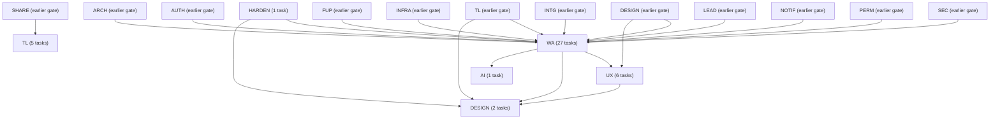
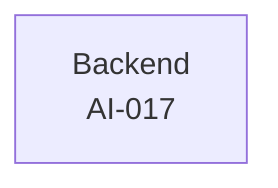
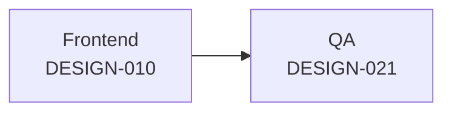
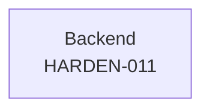
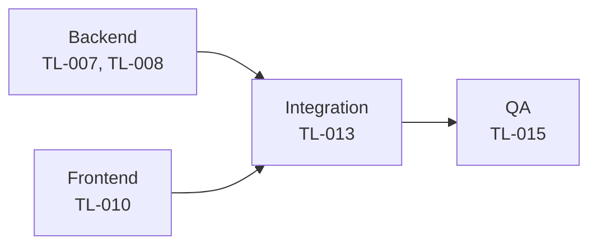
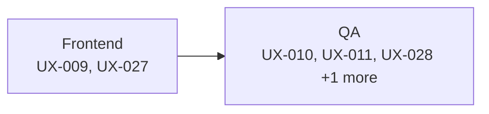
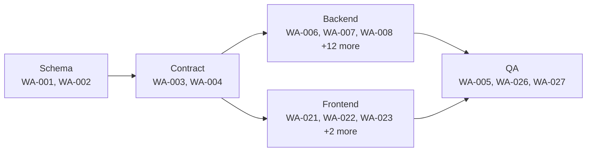

# G3 -- The Wedge (WhatsApp Coexistence)

**Scope:** WhatsApp Coexistence, inbox, health. 42 tasks across 6 domains: AI, DESIGN, HARDEN, TL, UX, WA.

> `gate` is a roadmap grouping label (see [`12-roadmap.md`](../12-roadmap.md)), not a scheduling dependency. The arrows below are real `depends_on` edges rolled up to domain level; each task's own row further down lists its precise dependencies.

## Domain-level dependency graph

## AI

| ID | Title | Track | Size | Depends On | Spec Refs |
|---|---|---|---|---|---|
| TASK-AI-017 | Implement AI message-drafting assistance in the composer | backend | M | TASK-AI-007, TASK-AI-013, TASK-WA-024 | SN-AI-022, SN-AI-003 |

## DESIGN

| ID | Title | Track | Size | Depends On | Spec Refs |
|---|---|---|---|---|---|
| TASK-DESIGN-010 | Implement WhatsApp Coexistence domain components (MessageBubble, ConversationRow, HealthBadge) | frontend | M | TASK-DESIGN-002, TASK-DESIGN-004, TASK-WA-003, TASK-WA-004 | SN-DS-030, SN-DS-035 |
| TASK-DESIGN-021 | Demonstrate the G3 wedge gate exit criterion | qa | S | TASK-DESIGN-010, TASK-UX-011, TASK-UX-029, TASK-TL-008, TASK-HARDEN-011, TASK-WA-005, TASK-WA-027 | SN-WA-023, SN-WA-025, SN-TL-026 |

## HARDEN

| ID | Title | Track | Size | Depends On | Spec Refs |
|---|---|---|---|---|---|
| TASK-HARDEN-011 | Resolve WhatsApp provider decision (BSP vs direct Meta Tech Provider) | backend | M | - | - |

## TL

| ID | Title | Track | Size | Depends On | Spec Refs |
|---|---|---|---|---|---|
| TASK-TL-007 | Implement real-time timeline delivery via SSE | backend | M | TASK-TL-003, TASK-SHARE-006 | SN-TL-023 |
| TASK-TL-008 | Implement WhatsApp conversation rendering data and timeline gap markers | backend | M | TASK-TL-003 | SN-TL-024, SN-TL-025, SN-TL-026, SN-WA-023, SN-WA-025 |
| TASK-TL-010 | Build WhatsApp-in-timeline conversation UI | frontend | M | TASK-TL-003, TASK-TL-009 | SN-TL-023..026 |
| TASK-TL-013 | Integrate WhatsApp-in-timeline real-time rendering end-to-end | qa | M | TASK-TL-007, TASK-TL-008, TASK-TL-010 | SN-TL-023..026 |
| TASK-TL-015 | QA: verify WhatsApp-in-timeline rendering and gap markers | qa | S | TASK-TL-013 | SN-TL-023..026 |

## UX

| ID | Title | Track | Size | Depends On | Spec Refs |
|---|---|---|---|---|---|
| TASK-UX-009 | Implement the WhatsApp connection flow UI (Flow 3) | frontend | L | TASK-DESIGN-010, TASK-UX-001, TASK-UX-002, TASK-WA-003, TASK-WA-004 | SN-UX-003 |
| TASK-UX-010 | Integrate the WhatsApp connection flow with live backend | qa | M | TASK-UX-009, TASK-WA-006 | SN-UX-003 |
| TASK-UX-011 | QA Flow 3 against its budget | qa | S | TASK-UX-010 | SN-UX-003 |
| TASK-UX-027 | Implement the WhatsApp disconnection recovery flow UI (Flow 9) | frontend | M | TASK-DESIGN-010, TASK-WA-003 | SN-UX-009 |
| TASK-UX-028 | Integrate the disconnection recovery flow with live backend | qa | S | TASK-UX-027, TASK-WA-015 | SN-UX-009 |
| TASK-UX-029 | QA Flow 9 against its budget | qa | S | TASK-UX-028 | SN-UX-009 |

## WA

| ID | Title | Track | Size | Depends On | Spec Refs |
|---|---|---|---|---|---|
| TASK-WA-001 | Create WhatsApp account and message schema | backend | M | TASK-AUTH-002, TASK-PERM-003 | SN-WA-020, SN-WA-021, SN-WA-022, SN-WA-026, SN-WA-081, SN-WA-082, SN-WA-083 |
| TASK-WA-002 | Create coexistence sync job and health-tracking schema | backend | M | TASK-WA-001 | SN-WA-024, SN-WA-040, SN-WA-041, SN-WA-081, SN-WA-085 |
| TASK-WA-003 | Define WhatsApp onboarding API contract and WhatsAppChannelProvider port | backend | M | TASK-WA-001, TASK-WA-002, TASK-HARDEN-011, TASK-ARCH-004 | SN-WA-001, SN-WA-010, SN-WA-011, SN-WA-012, SN-WA-014, SN-WA-080 |
| TASK-WA-004 | Define messaging, inbox and webhook API contract | backend | M | TASK-WA-001, TASK-WA-002, TASK-WA-003, TASK-ARCH-004 | SN-WA-020, SN-WA-030, SN-WA-031, SN-WA-032, SN-WA-034, SN-WA-041, SN-WA-050, SN-WA-051 |
| TASK-WA-005 | Re-verify Meta Coexistence constraints against current provider documentation | qa | S | TASK-HARDEN-011 | SN-WA-001, SN-COMP-021 |
| TASK-WA-006 | Implement WhatsAppChannelProvider abstraction and concrete provider adapter | backend | M | TASK-WA-003, TASK-WA-005, TASK-HARDEN-011, TASK-ARCH-019 | SN-WA-080 |
| TASK-WA-007 | Implement onboarding: eligibility check, Embedded Signup and QR completion | backend | M | TASK-WA-001, TASK-WA-003, TASK-WA-006 | SN-WA-010, SN-WA-011, SN-WA-013 |
| TASK-WA-008 | Implement granular consent capture and multi-number account support | backend | M | TASK-WA-001, TASK-WA-007, TASK-TL-003 | SN-WA-012, SN-WA-014, SN-TL-025 |
| TASK-WA-009 | Implement smb_message_echoes and messages webhook ingestion with edit/revoke handling | backend | M | TASK-WA-001, TASK-WA-004, TASK-WA-006, TASK-INTG-009, TASK-SEC-011 | SN-WA-020, SN-WA-021, SN-WA-022, SN-WA-026 |
| TASK-WA-010 | Implement contact sync as a reviewable import | backend | M | TASK-WA-001, TASK-WA-002, TASK-WA-006 | SN-WA-023 |
| TASK-WA-011 | Implement 3-phase history sync with HISTORY_IMPORT triggering nothing | backend | L | TASK-WA-001, TASK-WA-002, TASK-WA-006, TASK-WA-009, TASK-NOTIF-003 | SN-WA-024, SN-WA-025 |
| TASK-WA-012 | Implement media re-hosting for WhatsApp attachments | backend | S | TASK-WA-001, TASK-WA-009, TASK-WA-011, TASK-INFRA-005 | SN-WA-027 |
| TASK-WA-013 | Implement API send path with service-window/opt-out enforcement and error mapping | backend | M | TASK-WA-001, TASK-WA-004, TASK-WA-006 | SN-WA-030, SN-WA-031, SN-WA-032, SN-WA-034 |
| TASK-WA-014 | Implement 5 msg/sec rate-limited send queue with visible ETA | backend | M | TASK-WA-001, TASK-WA-013 | SN-WA-033 |
| TASK-WA-015 | Implement health-state computation and continuous activity tracking | backend | M | TASK-WA-001, TASK-WA-002, TASK-WA-009 | SN-WA-040, SN-WA-041 |
| TASK-WA-016 | Implement proportionate health escalation notifications | backend | M | TASK-WA-015, TASK-NOTIF-006 | SN-WA-042, SN-WA-043 |
| TASK-WA-017 | Implement reconnection flow and timeline gap markers | backend | M | TASK-WA-001, TASK-WA-002, TASK-WA-015, TASK-TL-002 | SN-WA-044, SN-WA-045, SN-TL-026 |
| TASK-WA-018 | Implement inbox conversation query, CRM-context aggregation and SSE realtime | backend | L | TASK-WA-001, TASK-WA-004, TASK-WA-009, TASK-LEAD-004, TASK-FUP-002 | SN-WA-050, SN-WA-051, SN-WA-052, SN-WA-053 |
| TASK-WA-019 | Implement click-to-chat fallback and manual logging when disconnected | backend | S | TASK-TL-004 | SN-WA-070, SN-WA-071 |
| TASK-WA-020 | Implement free-traffic metering guard and template cost hook | backend | M | TASK-WA-013 | SN-WA-060, SN-WA-061, SN-WA-062 |
| TASK-WA-021 | Build WhatsApp onboarding wizard UI | frontend | L | TASK-WA-003, TASK-DESIGN-005 | SN-WA-001, SN-WA-010, SN-WA-011, SN-WA-012, SN-WA-013, SN-WA-014 |
| TASK-WA-022 | Build WhatsApp health banner and reconnection UI | frontend | M | TASK-WA-004 | SN-WA-041, SN-WA-042, SN-WA-043, SN-WA-044 |
| TASK-WA-023 | Build WhatsApp timeline rendering: echoes, edits, revocations and gap markers | frontend | M | TASK-WA-004, TASK-TL-009 | SN-WA-021, SN-WA-022, SN-WA-024, SN-WA-025, SN-WA-045, SN-TL-025, SN-TL-026 |
| TASK-WA-024 | Build the lead-centric WhatsApp inbox UI | frontend | L | TASK-WA-004, TASK-DESIGN-010 | SN-WA-030, SN-WA-031, SN-WA-034, SN-WA-050, SN-WA-051, SN-WA-052, SN-WA-053 |
| TASK-WA-025 | Build click-to-chat entry points across the app | frontend | S | TASK-WA-004, TASK-DESIGN-007 | SN-WA-070, SN-WA-071 |
| TASK-WA-026 | Integrate WhatsApp frontend with live backend end to end | qa | L | TASK-WA-006, TASK-WA-007, TASK-WA-008, TASK-WA-009, TASK-WA-010, TASK-WA-011, TASK-WA-012, TASK-WA-013, TASK-WA-014, TASK-WA-015, TASK-WA-016, TASK-WA-017, TASK-WA-018, TASK-WA-019, TASK-WA-020, TASK-WA-021, TASK-WA-022, TASK-WA-023, TASK-WA-024, TASK-WA-025 | SN-WA-010, SN-WA-020, SN-WA-041, SN-WA-050 |
| TASK-WA-027 | QA verification of WhatsApp Coexistence acceptance criteria | qa | M | TASK-WA-026 | SN-WA-001, SN-WA-011, SN-WA-012, SN-WA-021, SN-WA-022, SN-WA-025, SN-WA-026, SN-WA-041, SN-WA-042, SN-WA-044, SN-WA-045 |

