# G4 -- Scale & Commerce

**Scope:** sequences, automation, campaigns, billing, analytics, agency. 137 tasks across 13 domains: AGCY, AI, ANL, ARCH, BILL, CAMP, DESIGN, HARDEN, PERM, RULE, SEC, SEQ, UX.

> `gate` is a roadmap grouping label (see [`12-roadmap.md`](../12-roadmap.md)), not a scheduling dependency. The arrows below are real `depends_on` edges rolled up to domain level; each task's own row further down lists its precise dependencies.

## Domain-level dependency graph

```mermaid
flowchart TD
    ARCH_ext["ARCH (earlier gate)"]
    AUTH_ext["AUTH (earlier gate)"]
    CONT_ext["CONT (earlier gate)"]
    DATA_ext["DATA (earlier gate)"]
    DESIGN_ext["DESIGN (earlier gate)"]
    FIELD_ext["FIELD (earlier gate)"]
    FORM_ext["FORM (earlier gate)"]
    FUP_ext["FUP (earlier gate)"]
    INFRA_ext["INFRA (earlier gate)"]
    INTG_ext["INTG (earlier gate)"]
    LEAD_ext["LEAD (earlier gate)"]
    NOTIF_ext["NOTIF (earlier gate)"]
    PERM_ext["PERM (earlier gate)"]
    SEC_ext["SEC (earlier gate)"]
    SHARE_ext["SHARE (earlier gate)"]
    TEAM_ext["TEAM (earlier gate)"]
    TL_ext["TL (earlier gate)"]
    WA_ext["WA (earlier gate)"]
    AGCY["AGCY (12 tasks)"]
    AI["AI (5 tasks)"]
    ANL["ANL (18 tasks)"]
    ARCH["ARCH (3 tasks)"]
    BILL["BILL (19 tasks)"]
    CAMP["CAMP (27 tasks)"]
    DESIGN["DESIGN (1 task)"]
    HARDEN["HARDEN (1 task)"]
    PERM["PERM (8 tasks)"]
    RULE["RULE (15 tasks)"]
    SEC["SEC (3 tasks)"]
    SEQ["SEQ (14 tasks)"]
    UX["UX (11 tasks)"]
    AGCY --> PERM
    ANL --> HARDEN
    ARCH_ext --> AGCY
    ARCH_ext --> ANL
    ARCH_ext --> BILL
    ARCH_ext --> CAMP
    ARCH_ext --> PERM
    AUTH_ext --> AGCY
    AUTH_ext --> BILL
    AUTH_ext --> RULE
    AUTH_ext --> SEQ
    BILL --> AGCY
    BILL --> AI
    BILL --> CAMP
    BILL --> PERM
    BILL --> RULE
    BILL --> SEC
    BILL --> SEQ
    BILL --> UX
    CAMP --> ANL
    CAMP --> SEC
    CAMP --> UX
    CONT_ext --> ANL
    CONT_ext --> ARCH
    CONT_ext --> SEQ
    DATA_ext --> HARDEN
    DESIGN_ext --> AGCY
    DESIGN_ext --> AI
    DESIGN_ext --> ANL
    DESIGN_ext --> ARCH
    DESIGN_ext --> BILL
    DESIGN_ext --> CAMP
    DESIGN_ext --> RULE
    DESIGN_ext --> SEQ
    DESIGN_ext --> UX
    FIELD_ext --> ANL
    FIELD_ext --> CAMP
    FIELD_ext --> SEQ
    FORM_ext --> AGCY
    FUP_ext --> ANL
    FUP_ext --> SEQ
    INFRA_ext --> ANL
    INFRA_ext --> BILL
    INFRA_ext --> RULE
    INFRA_ext --> SEQ
    INTG_ext --> AGCY
    INTG_ext --> AI
    INTG_ext --> ANL
    INTG_ext --> HARDEN
    INTG_ext --> RULE
    LEAD_ext --> ANL
    LEAD_ext --> ARCH
    LEAD_ext --> CAMP
    LEAD_ext --> RULE
    LEAD_ext --> SEQ
    NOTIF_ext --> AGCY
    NOTIF_ext --> BILL
    NOTIF_ext --> UX
    PERM_ext --> ANL
    PERM_ext --> BILL
    PERM_ext --> DESIGN
    PERM_ext --> SEQ
    PERM_ext --> UX
    RULE --> DESIGN
    RULE --> UX
    SEC_ext --> AGCY
    SEC_ext --> BILL
    SEC_ext --> CAMP
    SEQ --> AI
    SEQ --> ARCH
    SEQ --> CAMP
    SEQ --> DESIGN
    SEQ --> RULE
    SEQ --> UX
    SHARE_ext --> ANL
    SHARE_ext --> SEQ
    TEAM_ext --> ANL
    TEAM_ext --> ARCH
    TEAM_ext --> RULE
    TL_ext --> AI
    TL_ext --> ANL
    TL_ext --> BILL
    WA_ext --> AGCY
    WA_ext --> AI
    WA_ext --> ANL
    WA_ext --> CAMP
    WA_ext --> RULE
    WA_ext --> SEQ
```

## AGCY

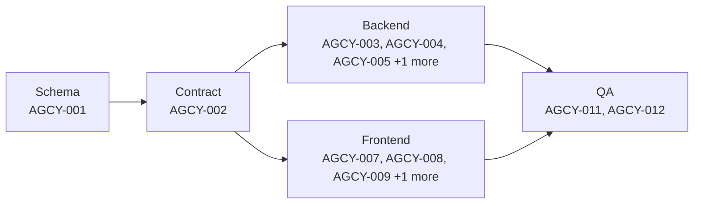

| ID | Title | Track | Size | Depends On | Spec Refs |
|---|---|---|---|---|---|
| TASK-AGCY-001 | Migrate schema for agency relationships, impersonation and branding cascade | backend | M | TASK-SEC-001, TASK-AUTH-002 | SN-AGCY-001, SN-AGCY-010, SN-AGCY-020, SN-AGCY-021, SN-AGCY-022, SN-AGCY-023, SN-AGCY-024, SN-AGCY-041, SN-AGCY-042 |
| TASK-AGCY-002 | Define agency, impersonation, sponsorship and branding API contracts | backend | M | TASK-AGCY-001, TASK-ARCH-004 | SN-AGCY-001, SN-AGCY-002, SN-AGCY-011, SN-AGCY-012, SN-AGCY-020, SN-AGCY-021, SN-AGCY-024, SN-AGCY-030, SN-AGCY-031, SN-AGCY-032, SN-AGCY-041, SN-AGCY-042 |
| TASK-AGCY-003 | Implement agency-client relationship lifecycle logic | backend | M | TASK-AGCY-002, TASK-WA-015, TASK-INTG-010, TASK-BILL-007 | SN-AGCY-001, SN-AGCY-002, SN-AGCY-011, SN-AGCY-012 |
| TASK-AGCY-004 | Implement impersonation session engine (security-critical) | backend | L | TASK-AGCY-001, TASK-AGCY-002, TASK-NOTIF-006, TASK-SEC-003, TASK-ARCH-020 | SN-AGCY-020, SN-AGCY-021, SN-AGCY-022, SN-AGCY-023, SN-AGCY-024, SN-AGCY-025, SN-AGCY-026 |
| TASK-AGCY-005 | Implement sponsorship billing logic | backend | M | TASK-AGCY-001, TASK-AGCY-002, TASK-BILL-001, TASK-BILL-003, TASK-BILL-004 | SN-AGCY-030, SN-AGCY-031, SN-AGCY-032 |
| TASK-AGCY-006 | Implement white-label branding cascade and custom share domain | backend | M | TASK-AGCY-001, TASK-AGCY-002, TASK-FORM-012 | SN-AGCY-040, SN-AGCY-041, SN-AGCY-042 |
| TASK-AGCY-007 | Build agency console UI | frontend | M | TASK-AGCY-002, TASK-DESIGN-006, TASK-DESIGN-004 | SN-AGCY-011, SN-AGCY-012 |
| TASK-AGCY-008 | Build client-side agency permission management and impersonation history UI | frontend | S | TASK-AGCY-002, TASK-DESIGN-006 | SN-AGCY-001, SN-AGCY-002, SN-AGCY-026 |
| TASK-AGCY-009 | Build impersonation banner and in-session UI | frontend | S | TASK-AGCY-002, TASK-DESIGN-004 | SN-AGCY-021, SN-AGCY-022, SN-AGCY-024 |
| TASK-AGCY-010 | Build sponsorship and branding cascade UI | frontend | M | TASK-AGCY-002, TASK-DESIGN-003 | SN-AGCY-030, SN-AGCY-031, SN-AGCY-032, SN-AGCY-040, SN-AGCY-041, SN-AGCY-042 |
| TASK-AGCY-011 | Integrate agency & impersonation frontend with live backend, gated on security review | qa | M | TASK-AGCY-004, TASK-AGCY-007, TASK-AGCY-008, TASK-AGCY-009 | SN-AGCY-001..002, SN-AGCY-020..026 |
| TASK-AGCY-012 | QA verification of agency & white-label acceptance criteria | qa | S | TASK-AGCY-011 | SN-AGCY-002, SN-AGCY-021, SN-AGCY-023, SN-AGCY-024 |

## AI

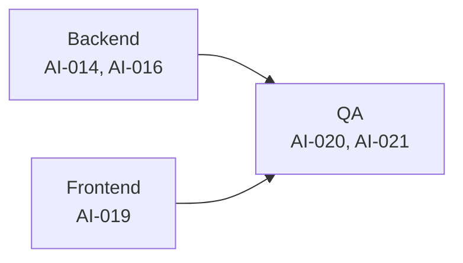

| ID | Title | Track | Size | Depends On | Spec Refs |
|---|---|---|---|---|---|
| TASK-AI-014 | Implement per-tenant AI cost controls and usage caps | backend | M | TASK-AI-006, TASK-BILL-009 | SN-AI-044, SN-BILL-041 |
| TASK-AI-016 | Implement AI sequence-generation draft capability | backend | M | TASK-AI-007, TASK-AI-013, TASK-SEQ-004 | SN-AI-021 |
| TASK-AI-019 | Build AI-assisted review and drafting UI surfaces | frontend | M | TASK-AI-007, TASK-WA-024, TASK-DESIGN-004, TASK-SEQ-009 | SN-AI-020, SN-AI-021, SN-AI-022, SN-AI-023 |
| TASK-AI-020 | Integrate AI capabilities end to end with the real LlmProvider | qa | M | TASK-AI-008, TASK-INTG-008, TASK-AI-016, TASK-AI-017, TASK-AI-018, TASK-AI-019 | SN-AI-020, SN-AI-021, SN-AI-022 |
| TASK-AI-021 | Verify AI substrate write-time-capture and governance checklist | qa | M | TASK-TL-001, TASK-AI-002, TASK-AI-003, TASK-AI-004, TASK-AI-005, TASK-AI-008, TASK-AI-009, TASK-AI-010, TASK-AI-020 | SN-AI-001..045 |

## ANL

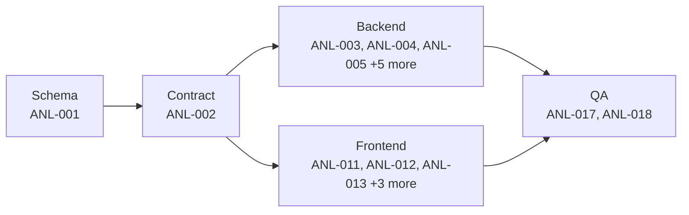

| ID | Title | Track | Size | Depends On | Spec Refs |
|---|---|---|---|---|---|
| TASK-ANL-001 | Migrate schema for analytics rollup tables | backend | M | TASK-TL-001, TASK-TL-002, TASK-LEAD-001 | SN-ANL-030, SN-ANL-031, SN-ANL-032 |
| TASK-ANL-002 | Define analytics dashboard API contracts | backend | M | TASK-ANL-001, TASK-ARCH-004, TASK-PERM-003 | SN-ANL-003, SN-ANL-004, SN-ANL-005 |
| TASK-ANL-003 | Implement overview dashboard and 'the leak' query | backend | M | TASK-ANL-002, TASK-LEAD-004, TASK-FUP-002 | SN-ANL-001, SN-ANL-002, SN-ANL-010 |
| TASK-ANL-004 | Implement lead analytics engine | backend | M | TASK-ANL-002, TASK-INTG-004, TASK-FIELD-005 | SN-ANL-011 |
| TASK-ANL-005 | Implement content analytics engine | backend | S | TASK-ANL-002, TASK-CONT-002, TASK-SHARE-002 | SN-ANL-012 |
| TASK-ANL-006 | Implement WhatsApp analytics engine | backend | M | TASK-ANL-002, TASK-WA-001, TASK-CAMP-019 | SN-ANL-014 |
| TASK-ANL-007 | Wire team analytics route to shared team-dashboard logic | backend | S | TASK-ANL-002, TASK-TEAM-005 | SN-ANL-013 |
| TASK-ANL-008 | Implement activity feed endpoint | backend | S | TASK-ANL-002, TASK-TL-003 | SN-ANL-015 |
| TASK-ANL-009 | Implement personal analytics view and anonymised comparison | backend | S | TASK-ANL-002, TASK-ANL-003 | SN-ANL-020, SN-ANL-021 |
| TASK-ANL-010 | Implement nightly rollup job and rebuild command | backend | M | TASK-ANL-001, TASK-INFRA-004 | SN-ANL-030, SN-ANL-031, SN-ANL-032 |
| TASK-ANL-011 | Build overview dashboard UI | frontend | M | TASK-ANL-002, TASK-DESIGN-022 | SN-ANL-001, SN-ANL-003, SN-ANL-004, SN-ANL-010 |
| TASK-ANL-012 | Build lead analytics UI | frontend | M | TASK-ANL-002, TASK-DESIGN-022 | SN-ANL-011 |
| TASK-ANL-013 | Build content analytics UI | frontend | S | TASK-ANL-002, TASK-DESIGN-006 | SN-ANL-012 |
| TASK-ANL-014 | Build WhatsApp analytics UI | frontend | M | TASK-ANL-002, TASK-DESIGN-022 | SN-ANL-014 |
| TASK-ANL-015 | Build activity feed UI | frontend | S | TASK-ANL-002, TASK-DESIGN-006 | SN-ANL-015 |
| TASK-ANL-016 | Build personal analytics view, comparison and empty states | frontend | S | TASK-ANL-002, TASK-DESIGN-004 | SN-ANL-020, SN-ANL-021, SN-ANL-033 |
| TASK-ANL-017 | Integrate analytics frontend with live backend and rollups | qa | M | TASK-ANL-003, TASK-ANL-004, TASK-ANL-005, TASK-ANL-006, TASK-ANL-007, TASK-ANL-008, TASK-ANL-009, TASK-ANL-011, TASK-ANL-012, TASK-ANL-013, TASK-ANL-014, TASK-ANL-015, TASK-ANL-016 | SN-ANL-001..005, SN-ANL-010..015, SN-ANL-020, SN-ANL-021 |
| TASK-ANL-018 | QA verification of analytics performance and correctness | qa | S | TASK-ANL-017 | SN-ANL-005, SN-ANL-031, SN-ANL-032 |

## ARCH

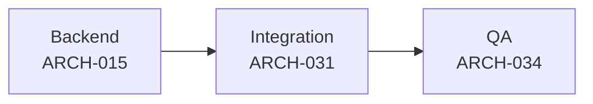

| ID | Title | Track | Size | Depends On | Spec Refs |
|---|---|---|---|---|---|
| TASK-ARCH-015 | Implement PostgreSQL full-text and phone-normalised search service | backend | M | TASK-ARCH-006, TASK-LEAD-001, TASK-CONT-001, TASK-SEQ-001, TASK-TEAM-002 | SN-ARCH-015 |
| TASK-ARCH-031 | Integrate global search end-to-end | qa | S | TASK-ARCH-015, TASK-ARCH-025 | SN-ARCH-015, SN-ARCH-104 |
| TASK-ARCH-034 | QA: verify IA cross-cutting states, responsive breakpoints and search performance | qa | S | TASK-DESIGN-005, TASK-ARCH-031 | SN-ARCH-030, SN-ARCH-015, SN-ARCH-103, SN-ARCH-113, SN-ARCH-104 |

## BILL

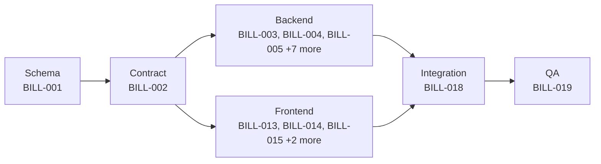

| ID | Title | Track | Size | Depends On | Spec Refs |
|---|---|---|---|---|---|
| TASK-BILL-001 | Create billing/subscription/credit schema (migrations + models + constraints) | backend | M | TASK-AUTH-002 | SN-BILL-010..014, SN-BILL-040..042, SN-SEC-003, SN-BILL-063 |
| TASK-BILL-002 | Define billing API contract, validation, policies and generated types | backend | M | TASK-BILL-001, TASK-ARCH-004, TASK-PERM-003 | SN-BILL-003, SN-BILL-023, SN-BILL-024, SN-BILL-031, SN-BILL-032, SN-BILL-050..052 |
| TASK-BILL-003 | Implement PaymentProvider port + Razorpay adapter (India rail) | backend | L | TASK-BILL-001, TASK-BILL-002, TASK-SEC-008, TASK-ARCH-019 | SN-BILL-001, SN-BILL-003, SN-BILL-020, SN-BILL-021 |
| TASK-BILL-004 | Implement Stripe adapter (international rail) behind the same port | backend | M | TASK-BILL-001, TASK-BILL-002, TASK-SEC-008, TASK-ARCH-019 | SN-BILL-002, SN-BILL-003, SN-BILL-014 |
| TASK-BILL-005 | Implement seat/plan proration and upgrade-immediate / downgrade-at-period-end logic | backend | M | TASK-BILL-002, TASK-BILL-003, TASK-BILL-004, TASK-PERM-011 | SN-BILL-011, SN-BILL-050, SN-BILL-051 |
| TASK-BILL-006 | Implement 14-day no-card trial with self-serve one-time 7-day extension | backend | S | TASK-BILL-002 | SN-BILL-013 |
| TASK-BILL-007 | Implement dunning state machine and access-gating on payment failure | backend | M | TASK-BILL-002, TASK-BILL-012, TASK-NOTIF-006 | SN-BILL-012, SN-BILL-022 |
| TASK-BILL-008 | Implement GST-compliant invoicing and GSTIN capture | backend | M | TASK-BILL-002, TASK-BILL-003 | SN-BILL-030, SN-BILL-031, SN-BILL-032 |
| TASK-BILL-009 | Implement prepaid credit ledger, auto-topup cap enforcement and daily reconciliation | backend | M | TASK-BILL-001, TASK-BILL-002, TASK-INFRA-004 | SN-BILL-040..042, SN-ARCH-011 |
| TASK-BILL-010 | Implement payment-method summary sanitization and hosted-checkout enforcement | backend | S | TASK-BILL-002, TASK-BILL-003, TASK-BILL-004 | SN-BILL-023, SN-BILL-024 |
| TASK-BILL-011 | Implement self-serve cancellation and one-click reactivation | backend | S | TASK-BILL-002, TASK-BILL-003, TASK-BILL-004 | SN-BILL-052 |
| TASK-BILL-012 | Implement webhook ingestion, signature verification and nightly reconciliation job | backend | M | TASK-BILL-001, TASK-BILL-002, TASK-BILL-003, TASK-BILL-004, TASK-TL-001, TASK-INFRA-004, TASK-SEC-011 | SN-BILL-060..062, SN-AI-010, SN-ARCH-011 |
| TASK-BILL-013 | Build billing and subscription settings UI (status, seats, upgrade/downgrade, cancellation) | frontend | M | TASK-BILL-002, TASK-DESIGN-003, TASK-DESIGN-004 | SN-BILL-012, SN-BILL-050..052 |
| TASK-BILL-014 | Build checkout, payment-method and pre-debit notification UI | frontend | M | TASK-BILL-002, TASK-DESIGN-003 | SN-BILL-020..024 |
| TASK-BILL-015 | Build invoice history and GSTIN capture UI | frontend | S | TASK-BILL-002, TASK-DESIGN-006, TASK-DESIGN-003 | SN-BILL-030..032 |
| TASK-BILL-016 | Build credit top-up and auto-topup UI | frontend | S | TASK-BILL-002, TASK-DESIGN-003 | SN-BILL-040..041 |
| TASK-BILL-017 | Build trial status banner and self-serve extension UI | frontend | S | TASK-BILL-002, TASK-DESIGN-004 | SN-BILL-013 |
| TASK-BILL-018 | Integrate billing frontend with live Razorpay/Stripe backend end-to-end | qa | L | TASK-BILL-003, TASK-BILL-004, TASK-BILL-005, TASK-BILL-006, TASK-BILL-007, TASK-BILL-008, TASK-BILL-009, TASK-BILL-010, TASK-BILL-011, TASK-BILL-012, TASK-BILL-013, TASK-BILL-014, TASK-BILL-015, TASK-BILL-016, TASK-BILL-017 | SN-BILL-060, SN-BILL-061 |
| TASK-BILL-019 | QA billing acceptance criteria and PCI/data-retention checks | qa | M | TASK-BILL-018 | SN-BILL-011, SN-BILL-022, SN-BILL-023, SN-BILL-030, SN-BILL-060 |

## CAMP

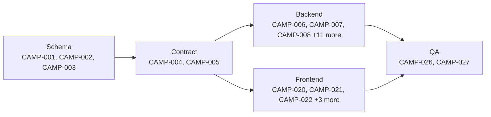

| ID | Title | Track | Size | Depends On | Spec Refs |
|---|---|---|---|---|---|
| TASK-CAMP-001 | Create WhatsApp template schema | backend | S | TASK-WA-001 | SN-CAMP-001, SN-CAMP-002, SN-CAMP-005, SN-WA-084 |
| TASK-CAMP-002 | Create campaign and campaign_recipient schema | backend | M | TASK-CAMP-001, TASK-LEAD-008 | SN-CAMP-010, SN-CAMP-011, SN-CAMP-014, SN-WA-084 |
| TASK-CAMP-003 | Create credit ledger schema | backend | S | TASK-BILL-001 | SN-CAMP-030, SN-CAMP-033 |
| TASK-CAMP-004 | Define template API contract and authoring validation rules | backend | M | TASK-CAMP-001, TASK-ARCH-004 | SN-CAMP-002, SN-CAMP-003, SN-CAMP-004, SN-CAMP-006 |
| TASK-CAMP-005 | Define campaign API contract including costed preview endpoint | backend | M | TASK-CAMP-002, TASK-ARCH-004 | SN-CAMP-010, SN-CAMP-011, SN-CAMP-012, SN-CAMP-013, SN-CAMP-015, SN-CAMP-016 |
| TASK-CAMP-006 | Implement template authoring validation engine | backend | M | TASK-CAMP-001, TASK-CAMP-004 | SN-CAMP-002, SN-CAMP-003 |
| TASK-CAMP-007 | Implement template submission and Meta approval lifecycle sync | backend | M | TASK-CAMP-001, TASK-CAMP-004, TASK-CAMP-006, TASK-WA-006 | SN-CAMP-001 |
| TASK-CAMP-008 | Implement pre-built template library | backend | S | TASK-CAMP-004, TASK-CAMP-007 | SN-CAMP-006 |
| TASK-CAMP-009 | Implement template variable binding with live preview against a real lead | backend | S | TASK-CAMP-001, TASK-CAMP-004, TASK-LEAD-004, TASK-FIELD-002 | SN-CAMP-004 |
| TASK-CAMP-010 | Implement quality-score and number quality_rating ingestion | backend | S | TASK-CAMP-001, TASK-WA-006 | SN-CAMP-005 |
| TASK-CAMP-011 | Implement campaign audience resolution engine (FILTER/UPLOAD/PASTE) | backend | M | TASK-CAMP-002, TASK-CAMP-005, TASK-LEAD-008 | SN-CAMP-011, SN-LEAD-081 |
| TASK-CAMP-012 | Implement costed campaign preview engine | backend | M | TASK-CAMP-005, TASK-CAMP-009, TASK-CAMP-011, TASK-WA-014 | SN-CAMP-012 |
| TASK-CAMP-013 | Implement campaign dispatch engine, lifecycle state machine and mid-send cancellation | backend | M | TASK-CAMP-002, TASK-CAMP-005, TASK-CAMP-007, TASK-CAMP-012, TASK-WA-014 | SN-CAMP-010, SN-CAMP-013, SN-CAMP-015 |
| TASK-CAMP-014 | Implement per-recipient delivery status webhook processing | backend | M | TASK-CAMP-002, TASK-CAMP-013 | SN-CAMP-014 |
| TASK-CAMP-015 | Implement scheduling with org timezone and quiet-hours enforcement | backend | S | TASK-CAMP-002, TASK-CAMP-005 | SN-CAMP-016 |
| TASK-CAMP-016 | Implement opt-out enforcement at dispatch and marketing opt-out path requirement | backend | M | TASK-CAMP-002, TASK-CAMP-004, TASK-CAMP-013, TASK-SEC-023, TASK-SEQ-005 | SN-CAMP-020, SN-CAMP-021, SN-CAMP-022, SN-SEQ-023 |
| TASK-CAMP-017 | Implement campaign quality guardrails engine | backend | M | TASK-CAMP-005, TASK-CAMP-010, TASK-CAMP-013 | SN-CAMP-023 |
| TASK-CAMP-018 | Implement prepaid billing/credits logic and ledger reconciliation | backend | M | TASK-CAMP-003, TASK-CAMP-012, TASK-CAMP-013, TASK-BILL-003, TASK-BILL-004 | SN-CAMP-030, SN-CAMP-031, SN-CAMP-032, SN-CAMP-033 |
| TASK-CAMP-019 | Implement campaign and cross-campaign reporting rollups | backend | M | TASK-CAMP-013, TASK-CAMP-014, TASK-WA-009 | SN-CAMP-040, SN-CAMP-041, SN-CAMP-042 |
| TASK-CAMP-020 | Build the template builder UI | frontend | L | TASK-CAMP-004, TASK-DESIGN-003 | SN-CAMP-001, SN-CAMP-002, SN-CAMP-003, SN-CAMP-004, SN-CAMP-005, SN-CAMP-006 |
| TASK-CAMP-021 | Build the campaign builder UI | frontend | L | TASK-CAMP-005, TASK-LEAD-004, TASK-LEAD-019 | SN-CAMP-011, SN-CAMP-012, SN-CAMP-013, SN-CAMP-016 |
| TASK-CAMP-022 | Build campaign monitoring UI (live status, cancel, funnel) | frontend | M | TASK-CAMP-005, TASK-DESIGN-006, TASK-DESIGN-022 | SN-CAMP-014, SN-CAMP-015, SN-CAMP-040 |
| TASK-CAMP-023 | Build compliance and quality guardrail UI | frontend | M | TASK-CAMP-005 | SN-CAMP-005, SN-CAMP-022, SN-CAMP-023 |
| TASK-CAMP-024 | Build billing/credits UI | frontend | M | TASK-CAMP-005, TASK-BILL-014 | SN-CAMP-030, SN-CAMP-031, SN-CAMP-032, SN-CAMP-033 |
| TASK-CAMP-025 | Build cross-campaign analytics dashboard UI | frontend | S | TASK-CAMP-005 | SN-CAMP-042 |
| TASK-CAMP-026 | Integrate WhatsApp campaigns frontend with live backend end to end | qa | L | TASK-CAMP-006, TASK-CAMP-007, TASK-CAMP-008, TASK-CAMP-009, TASK-CAMP-010, TASK-CAMP-011, TASK-CAMP-012, TASK-CAMP-013, TASK-CAMP-014, TASK-CAMP-015, TASK-CAMP-016, TASK-CAMP-017, TASK-CAMP-018, TASK-CAMP-019, TASK-CAMP-020, TASK-CAMP-021, TASK-CAMP-022, TASK-CAMP-023, TASK-CAMP-024, TASK-CAMP-025 | SN-CAMP-001, SN-CAMP-012, SN-CAMP-013, SN-CAMP-030 |
| TASK-CAMP-027 | QA verification of WhatsApp campaigns acceptance criteria | qa | S | TASK-CAMP-026 | SN-CAMP-012, SN-CAMP-014, SN-CAMP-016, SN-CAMP-020, SN-CAMP-022, SN-CAMP-023 |

## DESIGN

| ID | Title | Track | Size | Depends On | Spec Refs |
|---|---|---|---|---|---|
| TASK-DESIGN-011 | Implement Scale & Commerce domain components (SequenceStepCard, RuleConditionRow, UpgradeLock, CapabilityToggle) | frontend | M | TASK-DESIGN-002, TASK-DESIGN-004, TASK-PERM-002, TASK-SEQ-002, TASK-RULE-002 | SN-DS-030, SN-DS-034 |

## HARDEN

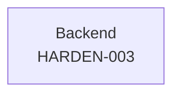

| ID | Title | Track | Size | Depends On | Spec Refs |
|---|---|---|---|---|---|
| TASK-HARDEN-003 | Implement graceful, honest degradation under load | backend | M | TASK-DATA-011, TASK-ANL-010, TASK-INTG-003 | SN-NFR-005, SN-NFR-003 |

## PERM

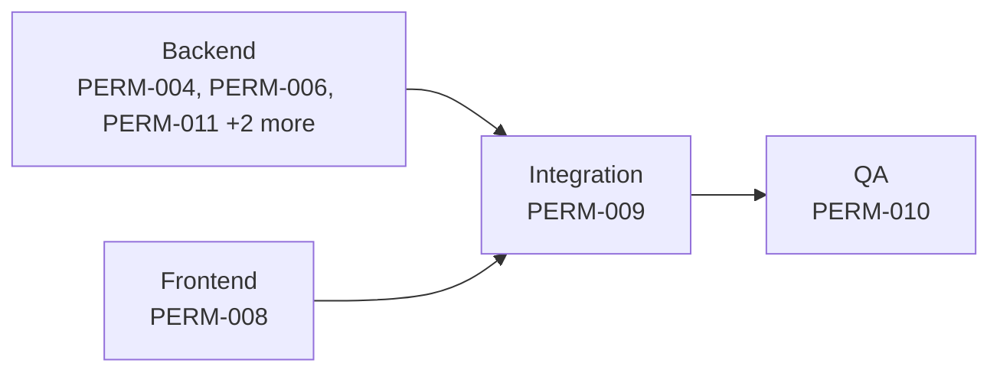

| ID | Title | Track | Size | Depends On | Spec Refs |
|---|---|---|---|---|---|
| TASK-PERM-004 | Implement plan-limit and paywall enforcement engine | backend | L | TASK-PERM-001, TASK-PERM-003 | SN-ARCH-020, SN-PERM-009 |
| TASK-PERM-006 | Implement agency impersonation authorisation framework | backend | L | TASK-PERM-003, TASK-AGCY-001 | SN-ARCH-020, SN-PERM-015 |
| TASK-PERM-008 | Build paywall UX components | frontend | M | TASK-PERM-002, TASK-ARCH-004 | SN-PERM-012, SN-PERM-013, SN-PERM-014 |
| TASK-PERM-009 | Integrate capability, plan and paywall enforcement end-to-end | qa | M | TASK-PERM-004, TASK-PERM-006, TASK-PERM-007, TASK-PERM-008, TASK-PERM-011, TASK-PERM-012, TASK-PERM-013 | SN-PERM-005, SN-PERM-006, SN-PERM-009 |
| TASK-PERM-010 | QA: verify permissions, plans and paywall against acceptance criteria | qa | M | TASK-PERM-009 | SN-ARCH-020, SN-PERM-005, SN-PERM-006, SN-PERM-009, SN-PERM-012 |
| TASK-PERM-011 | Implement seat-limit enforcement and self-serve proration hooks | backend | M | TASK-PERM-001, TASK-PERM-003 | SN-ARCH-020, SN-PERM-010 |
| TASK-PERM-012 | Implement downgrade data-retention and scheduled member-deactivation lifecycle | backend | M | TASK-PERM-001, TASK-PERM-003, TASK-PERM-004 | SN-ARCH-020, SN-PERM-009 |
| TASK-PERM-013 | Implement 9-state subscription-access matrix enforcement | backend | M | TASK-PERM-001, TASK-PERM-003, TASK-PERM-004, TASK-BILL-002 | SN-ARCH-020, SN-PERM-011 |

## RULE

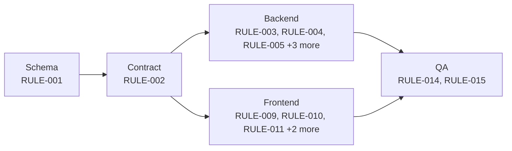

| ID | Title | Track | Size | Depends On | Spec Refs |
|---|---|---|---|---|---|
| TASK-RULE-001 | Schema: rules, execution/distribution logs, round-robin state, and CAPI per-lead fields | backend | M | TASK-LEAD-001, TASK-AUTH-002 | SN-RULE-001, SN-RULE-004, SN-RULE-010, SN-RULE-014, SN-RULE-022, SN-RULE-033, SN-RULE-051, SN-SEC-003, SN-RULE-054, SN-RULE-055, SN-RULE-056 |
| TASK-RULE-002 | Contract: rule CRUD, relative move, fields/values vocabulary, test, and CAPI config endpoints | backend | M | TASK-RULE-001 | SN-RULE-002, SN-RULE-003, SN-RULE-005, SN-RULE-010, SN-RULE-011, SN-RULE-013, SN-RULE-050 |
| TASK-RULE-003 | Backend logic: condition engine and dynamic field/value vocabulary | backend | M | TASK-RULE-002, TASK-INTG-002 | SN-RULE-001, SN-RULE-002, SN-RULE-003, SN-RULE-004, SN-RULE-005 |
| TASK-RULE-004 | Backend logic: synchronous priority-ordered evaluation pipeline with execution logging | backend | M | TASK-RULE-002, TASK-RULE-003, TASK-LEAD-012, TASK-INFRA-004 | SN-RULE-010, SN-RULE-011, SN-RULE-012, SN-RULE-013, SN-RULE-014, SN-ARCH-011, SN-SEC-010, SN-AI-010, SN-LEAD-060 |
| TASK-RULE-005 | Backend logic: routing actions - assign, groups, fields, notify, weighted round-robin | backend | M | TASK-RULE-004, TASK-SEQ-004, TASK-AUTH-002 | SN-RULE-020, SN-RULE-021, SN-RULE-022, SN-RULE-023 |
| TASK-RULE-006 | Backend logic: distribution actions - broadcast/round-robin, recipients, costing, log | backend | M | TASK-RULE-004, TASK-BILL-009 | SN-RULE-030, SN-RULE-031, SN-RULE-032, SN-RULE-033, SN-RULE-034 |
| TASK-RULE-007 | Backend logic: WhatsApp auto-responder composition and precondition checks | backend | S | TASK-RULE-005, TASK-SEQ-004, TASK-WA-001 | SN-RULE-040, SN-RULE-041 |
| TASK-RULE-008 | Backend logic: Meta Conversions API dispatch, PII hashing, and reporting | backend | M | TASK-RULE-002, TASK-INTG-004 | SN-RULE-050, SN-RULE-051, SN-RULE-052, SN-RULE-053 |
| TASK-RULE-009 | Frontend: shared rule builder - dynamic conditions, priority, test panel | frontend | L | TASK-RULE-002, TASK-DESIGN-003 | SN-RULE-001, SN-RULE-002, SN-RULE-003, SN-RULE-004, SN-RULE-005, SN-RULE-010, SN-RULE-011, SN-RULE-013 |
| TASK-RULE-010 | Frontend: routing rule actions UI - assign, round-robin, groups/fields/notify | frontend | M | TASK-RULE-002, TASK-DESIGN-003, TASK-SEQ-002 | SN-RULE-020, SN-RULE-021, SN-RULE-022, SN-RULE-023 |
| TASK-RULE-011 | Frontend: distribution rule UI - mode, recipients, costing, log viewer | frontend | M | TASK-RULE-002, TASK-DESIGN-006 | SN-RULE-030, SN-RULE-031, SN-RULE-032, SN-RULE-033, SN-RULE-034 |
| TASK-RULE-012 | Frontend: auto-responder guided setup and Meta CAPI configuration/reporting UI | frontend | M | TASK-RULE-002, TASK-DESIGN-005, TASK-DESIGN-022 | SN-RULE-040, SN-RULE-041, SN-RULE-050, SN-RULE-053 |
| TASK-RULE-013 | Frontend: rule execution log viewer | frontend | S | TASK-RULE-002, TASK-DESIGN-006 | SN-RULE-014 |
| TASK-RULE-014 | Integration: wire routing/distribution/auto-responder/CAPI frontend to live backend | qa | M | TASK-RULE-003, TASK-RULE-004, TASK-RULE-005, TASK-RULE-006, TASK-RULE-007, TASK-RULE-008, TASK-RULE-009, TASK-RULE-010, TASK-RULE-011, TASK-RULE-012, TASK-RULE-013, TASK-LEAD-007, TASK-AUTH-002, TASK-TEAM-005, TASK-INTG-004 | SN-RULE-010, SN-RULE-012, SN-RULE-022, SN-RULE-052 |
| TASK-RULE-015 | QA: verify automation acceptance criteria | qa | S | TASK-RULE-014 | SN-RULE-010, SN-RULE-012, SN-RULE-013, SN-RULE-022, SN-RULE-052 |

## SEC

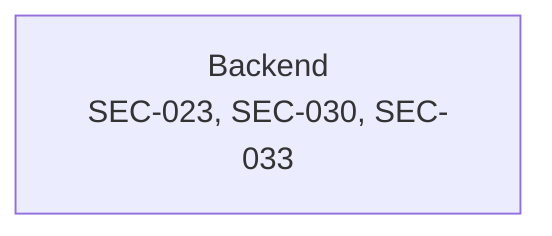

| ID | Title | Track | Size | Depends On | Spec Refs |
|---|---|---|---|---|---|
| TASK-SEC-023 | Implement WhatsApp opt-out registry enforced across every send path | backend | M | TASK-SEC-019 | SN-COMP-002 |
| TASK-SEC-030 | Implement WhatsApp Business Messaging Policy compliance guardrails | backend | M | TASK-SEC-023, TASK-CAMP-004, TASK-CAMP-006, TASK-CAMP-010, TASK-CAMP-017 | SN-COMP-020, SN-COMP-021, SN-CAMP-003, SN-CAMP-032, SN-CAMP-035 |
| TASK-SEC-033 | Implement payment compliance posture: PCI SAQ-A, RBI pre-debit notice, GST invoicing | backend | M | TASK-BILL-003, TASK-BILL-004, TASK-BILL-008, TASK-BILL-010 | SN-COMP-024, SN-BILL-024 |

## SEQ

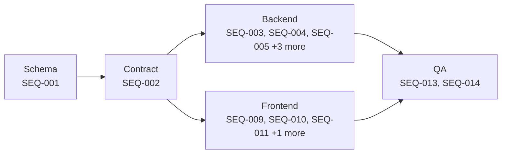

| ID | Title | Track | Size | Depends On | Spec Refs |
|---|---|---|---|---|---|
| TASK-SEQ-001 | Schema: sequences, steps, enrolments, and break-criteria configuration | backend | M | TASK-CONT-001, TASK-LEAD-001, TASK-AUTH-002 | SN-SEQ-001, SN-SEQ-002, SN-SEQ-010, SN-SEQ-012, SN-SEQ-013, SN-SEQ-020, SN-SEC-003, SN-SEQ-054, SN-SEQ-055, SN-SEQ-056 |
| TASK-SEQ-002 | Contract: sequence CRUD, relative step-move, enrolment, and /my-tasks endpoints | backend | M | TASK-SEQ-001, TASK-PERM-002 | SN-SEQ-010, SN-SEQ-012, SN-SEQ-013, SN-SEQ-030, SN-SEQ-031, SN-SEQ-050, SN-SEQ-051, SN-SEQ-052 |
| TASK-SEQ-003 | Backend logic: sequence builder domain rules - ordering, limits, visibility, permission split | backend | S | TASK-SEQ-002 | SN-SEQ-010, SN-SEQ-012, SN-SEQ-013 |
| TASK-SEQ-004 | Backend logic: enrolment engine - manual/bulk/preview, re-enrolment, removal | backend | M | TASK-SEQ-002, TASK-FIELD-005, TASK-WA-008 | SN-SEQ-012, SN-SEQ-030, SN-SEQ-031, SN-SEQ-032, SN-SEQ-033 |
| TASK-SEQ-005 | Backend logic: break-criteria engine | backend | M | TASK-SEQ-004, TASK-SHARE-006, TASK-FIELD-005, TASK-WA-009, TASK-WA-011 | SN-SEQ-020, SN-SEQ-021, SN-SEQ-022, SN-SEQ-023, SN-FIELD-020, SN-AI-010, SN-TL-026, SN-WA-023 |
| TASK-SEQ-006 | Backend logic: USER-step task queue - /my-tasks, complete/skip/snooze | backend | M | TASK-SEQ-004, TASK-SHARE-003, TASK-CONT-003, TASK-FUP-007 | SN-SEQ-040, SN-SEQ-041 |
| TASK-SEQ-007 | Backend logic: SYSTEM-step dispatcher with dispatch-time precondition re-verification | backend | L | TASK-SEQ-004, TASK-SHARE-003, TASK-INFRA-004, TASK-WA-013, TASK-BILL-009 | SN-SEQ-042, SN-SEQ-043, SN-SEQ-044, SN-SEQ-045, SN-ARCH-011, SN-WA-023, SN-WA-025 |
| TASK-SEQ-008 | Backend logic: live-sequence edit propagation and per-sequence reporting rollups | backend | M | TASK-SEQ-003, TASK-SEQ-004 | SN-SEQ-051, SN-SEQ-052 |
| TASK-SEQ-009 | Frontend: sequence builder - step list, break criteria, preview, lifecycle state | frontend | L | TASK-SEQ-002, TASK-DESIGN-006, TASK-DESIGN-004 | SN-SEQ-001, SN-SEQ-002, SN-SEQ-010, SN-SEQ-011, SN-SEQ-020, SN-SEQ-050, SN-SEQ-052, SN-SEQ-053 |
| TASK-SEQ-010 | Frontend: enrolment UI - manual, bulk with preview, re-enrolment, removal | frontend | M | TASK-SEQ-002, TASK-DESIGN-005 | SN-SEQ-030, SN-SEQ-031, SN-SEQ-032, SN-SEQ-033 |
| TASK-SEQ-011 | Frontend: My Tasks queue UI | frontend | M | TASK-SEQ-002, TASK-FUP-007 | SN-SEQ-040, SN-SEQ-041 |
| TASK-SEQ-012 | Frontend: live-edit impact dialog and per-sequence reporting dashboard | frontend | M | TASK-SEQ-002, TASK-DESIGN-022 | SN-SEQ-051, SN-SEQ-052 |
| TASK-SEQ-013 | Integration: wire sequence builder/enrolment/tasks/reporting to live backend | qa | M | TASK-SEQ-003, TASK-SEQ-004, TASK-SEQ-005, TASK-SEQ-006, TASK-SEQ-007, TASK-SEQ-008, TASK-SEQ-009, TASK-SEQ-010, TASK-SEQ-011, TASK-SEQ-012, TASK-WA-007 | SN-SEQ-002, SN-SEQ-042, SN-SEQ-043, SN-WA-023, SN-WA-025 |
| TASK-SEQ-014 | QA: verify sequence acceptance criteria | qa | S | TASK-SEQ-013 | SN-SEQ-020, SN-SEQ-023, SN-SEQ-043, SN-SEQ-044 |

## UX

| ID | Title | Track | Size | Depends On | Spec Refs |
|---|---|---|---|---|---|
| TASK-UX-007 | Integrate the lead-arrival flow with live backend | qa | M | TASK-UX-006, TASK-RULE-004, TASK-NOTIF-003 | SN-UX-002 |
| TASK-UX-008 | QA Flow 2 against its budget | qa | S | TASK-UX-007 | SN-UX-002 |
| TASK-UX-018 | Implement the manual sequence builder flow UI (Flow 6) | frontend | L | TASK-DESIGN-011, TASK-SEQ-002 | SN-UX-006 |
| TASK-UX-019 | Integrate the sequence builder flow with live backend | qa | M | TASK-UX-018, TASK-SEQ-004, TASK-SEQ-005, TASK-SEQ-006, TASK-SEQ-007 | SN-UX-006 |
| TASK-UX-020 | QA Flow 6 against its budget | qa | S | TASK-UX-019 | SN-UX-006 |
| TASK-UX-021 | Implement the WhatsApp campaign sending flow UI (Flow 7) | frontend | L | TASK-DESIGN-011, TASK-UX-001, TASK-CAMP-004, TASK-CAMP-005, TASK-BILL-002 | SN-UX-007 |
| TASK-UX-022 | Integrate the campaign sending flow with live backend | qa | M | TASK-UX-021, TASK-CAMP-013, TASK-BILL-009 | SN-UX-007 |
| TASK-UX-023 | QA Flow 7 against its budget | qa | S | TASK-UX-022 | SN-UX-007 |
| TASK-UX-024 | Implement the plan-limit paywall flow UI (Flow 8) | frontend | M | TASK-DESIGN-011, TASK-UX-001, TASK-PERM-008, TASK-PERM-002, TASK-BILL-002 | SN-UX-008 |
| TASK-UX-025 | Integrate the plan-limit flow with live backend | qa | S | TASK-UX-024, TASK-PERM-004, TASK-BILL-005 | SN-UX-008 |
| TASK-UX-026 | QA Flow 8 against its budget | qa | S | TASK-UX-025 | SN-UX-008 |

