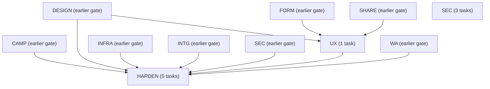
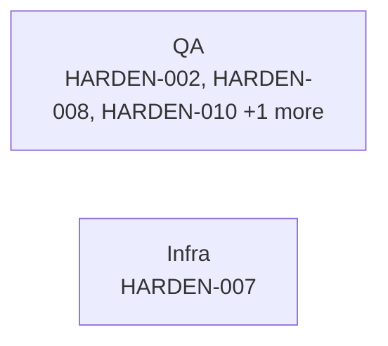
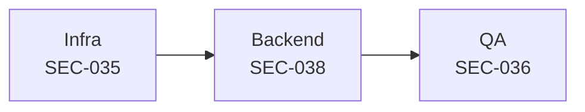
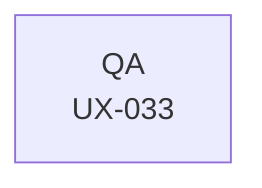

# G5 -- Hardening

**Scope:** pen test, load, a11y, legal, runbooks. 9 tasks across 3 domains: HARDEN, SEC, UX.

> `gate` is a roadmap grouping label (see [`12-roadmap.md`](../12-roadmap.md)), not a scheduling dependency. The arrows below are real `depends_on` edges rolled up to domain level; each task's own row further down lists its precise dependencies.

## Domain-level dependency graph

## HARDEN

| ID | Title | Track | Size | Depends On | Spec Refs |
|---|---|---|---|---|---|
| TASK-HARDEN-002 | Build load-testing suite at 2x V1 scale targets | qa | M | TASK-HARDEN-001, TASK-INTG-017, TASK-WA-027, TASK-CAMP-027 | SN-NFR-004 |
| TASK-HARDEN-007 | Write incident runbooks and launch the public status page | infra | M | TASK-INFRA-008 | SN-NFR-013 |
| TASK-HARDEN-008 | Run WCAG 2.1 AA accessibility audit and remediate | qa | L | TASK-UX-033, TASK-DESIGN-004 | SN-NFR-020 |
| TASK-HARDEN-010 | Verify the full operational-readiness launch-gate checklist | qa | S | TASK-HARDEN-001, TASK-HARDEN-002, TASK-INFRA-008, TASK-INFRA-006, TASK-HARDEN-007, TASK-HARDEN-008, TASK-HARDEN-009 | SN-NFR-001..013, SN-NFR-020, SN-NFR-030, SN-SEC-013, SN-PRIV-004 |
| TASK-HARDEN-013 | Complete legal review of DPDP, GDPR and platform policy; publish DPA/policy/ToS | qa | M | TASK-SEC-029, TASK-SEC-038 | SN-COMP-006, SN-COMP-010, SN-COMP-013, SN-COMP-014 |

## SEC

| ID | Title | Track | Size | Depends On | Spec Refs |
|---|---|---|---|---|---|
| TASK-SEC-035 | Publish security.txt and vulnerability-disclosure policy | infra | S | - | SN-SEC-014 |
| TASK-SEC-036 | Run third-party penetration test and remediate findings | qa | M | TASK-SEC-004, TASK-SEC-018 | SN-SEC-013 |
| TASK-SEC-038 | Publish DPA, sub-processor list and 30-day change-notification workflow | backend | S | - | SN-COMP-011 |

## UX

| ID | Title | Track | Size | Depends On | Spec Refs |
|---|---|---|---|---|---|
| TASK-UX-033 | Accessibility audit across all ten UX flows | qa | M | TASK-UX-005, TASK-UX-008, TASK-UX-011, TASK-UX-014, TASK-UX-017, TASK-UX-020, TASK-UX-023, TASK-UX-026, TASK-UX-029, TASK-UX-032, TASK-DESIGN-014, TASK-SHARE-009, TASK-FORM-012 | SN-UX-001, SN-UX-002, SN-UX-003, SN-UX-004, SN-UX-005, SN-UX-006, SN-UX-007, SN-UX-008, SN-UX-009, SN-UX-010 |

