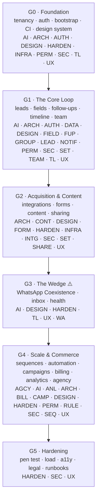

# SalesNova V1 task DAG

This is the working backlog for building SalesNova V1: every unit of implementation work, as one
task, with the dependencies between tasks made explicit so the order of work is a fact you can
query rather than a conversation you have to keep having. [`../README.md`](../README.md) (this
spec tree) is the source of truth for *what* to build; this directory is *who builds it and in
what order*.

**Who this is for:** human developers and coding agents picking up individual rows to implement,
engineering leads sequencing sprints, and any tool that wants a machine-readable project plan.
Don't hunt through tables for what to build next — run the CLI (§0 below). It reads a task's
`description`, `spec_refs` (which point back into the spec tree) and `acceptance_criteria`, checks
its `depends_on` list is satisfied, and tells you what's actually ready to start right now.

- **[`tasks.json`](tasks.json)** — the canonical, machine-readable, *stateful* list. All 526 tasks,
  one object each, plus a live `status` (`pending` / `in_progress` / `done`) that the CLI reads and
  writes. This is the only file you should edit programmatically — everything else in this
  directory is derived from it (or from its unstated predecessor, `_work/final-tasks.jsonl`) and
  will drift if you hand-edit a gate file instead.
- **[`cli/tasks.js`](cli/tasks.js)** — zero-dependency Node CLI over `tasks.json`. See §0. The
  backlog spans backend and frontend, so it is held once, here, and each code repo drives it through
  a shim at its own `docs/tasks/cli/`. A copy used to sit in each repo and the two drifted 23
  statuses apart, which left the frontend unable to see that endpoints its screens depended on were
  already built.
- **Per-gate files** — the same tasks, grouped by roadmap gate, with dependency diagrams and
  reference tables for browsing (these do **not** show live status — use the CLI for that):
  - [`G0-foundation.md`](G0-foundation.md) — tenancy, auth, bootstrap, CI, design system
  - [`G1-core-loop.md`](G1-core-loop.md) — leads, fields, follow-ups, timeline, team
  - [`G2-acquisition-content.md`](G2-acquisition-content.md) — integrations, forms, content, sharing
  - [`G3-whatsapp-wedge.md`](G3-whatsapp-wedge.md) — WhatsApp Coexistence, inbox, health
  - [`G4-scale-commerce.md`](G4-scale-commerce.md) — sequences, automation, campaigns, billing, analytics, agency
  - [`G5-hardening.md`](G5-hardening.md) — pen test, load, a11y, legal, runbooks
- **[`audit-report.md`](audit-report.md)** — three independent audits run against an earlier
  draft of this DAG, and an honest accounting of what's fixed, accepted, or still open in the
  version you're looking at now.

**Final count: 526 tasks across 29 domains.** (AGCY, AI, ANL, ARCH, AUTH, BILL, CAMP, CONT, DATA,
DESIGN, FIELD, FORM, FUP, GROUP, HARDEN, INFRA, INTG, LEAD, NOTIF, PERM, RULE, SEC, SEQ, SET,
SHARE, TEAM, TL, UX, WA.)

---

## 0. The CLI — start here

```
node docs/tasks/cli/tasks.js next                          # what can I start right now?
node docs/tasks/cli/tasks.js next --track backend --gate G0 # ...filtered to your track/gate
node docs/tasks/cli/tasks.js show TASK-ARCH-004             # full description, spec refs,
                                                              # live dependency status, acceptance criteria
node docs/tasks/cli/tasks.js status TASK-ARCH-004 done      # mark progress; prints what just unblocked
node docs/tasks/cli/tasks.js blocked                        # what's not ready, and what it's waiting on
node docs/tasks/cli/tasks.js progress --by track            # % done, by gate | track | domain
node docs/tasks/cli/tasks.js graph TASK-ARCH-005            # full ancestor/descendant chain
node docs/tasks/cli/tasks.js validate                       # duplicate ids, dangling refs, cycles
```

Those paths are the ones you type from a `salesnova_backend` or `salesnova_frontend` checkout, which
is where the work happens; from this repo the same commands are `node tasks/cli/tasks.js`.

No install step — plain Node, no dependencies. This is the recommended way for both a human
developer and a coding agent to pick up work: `next` gives you a queue that's always correct
because it's computed from live `status`, not a snapshot that goes stale the moment someone
finishes a task. The per-gate markdown files below are for browsing architecture (the mermaid
diagrams), not for tracking progress.

### Command reference

| Command | What it does |
|---|---|
| `next` | Lists tasks ready to start now — all `depends_on` satisfied, not blocked. Supports `--track`/`--domain`/`--gate` filters. |
| `show <TASK-ID>` | Full detail: description, spec refs, live dependency status per dep, acceptance criteria. |
| `status <TASK-ID> <pending\|in_progress\|done>` | Sets status; on transition to `done`, prints which tasks just became unblocked. |
| `blocked` | Lists not-yet-ready tasks and exactly what each is waiting on (plus `blocked_reason` if set). Supports the same filters as `next`. |
| `progress [--by gate\|track\|domain]` | Overall % done plus a breakdown by the chosen grouping (default `gate`). |
| `graph <TASK-ID>` | Full ancestor chain (must-finish-before) and descendant chain (blocked-on-this) for one task. |
| `validate` | Checks for duplicate ids, dangling `depends_on` refs, and dependency cycles. |
| `help` (or no args, or `--help`/`-h`) | Prints this same reference at the terminal. |

Filters (`--track`, `--domain`, `--gate`) apply to `next` and `blocked` only.

## 1. ID scheme

Every task ID is `TASK-<DOMAIN>-<NNN>`, e.g. `TASK-LEAD-004`. The domain code matches (with a
couple of pragmatic groupings — e.g. `TL` for Timeline, `SET` for Settings) the feature areas in
the main spec tree, so `TASK-WA-009` sits next to the WhatsApp Coexistence spec it implements. A
task's `spec_refs` field is the precise link: it lists the `MC-<AREA>-<NNN>` requirement IDs (as
used throughout `../` — see `../README.md` §5 "Requirement IDs") that this task is responsible for
satisfying. Follow `spec_refs` back into the spec tree whenever a task's one-line description
isn't enough context.

## 2. Track legend

| Track | Meaning |
|---|---|
| `backend` | Server-side: schema/migrations, API contracts, business logic. |
| `frontend` | Client-side UI: components, pages, flows. |
| `qa` | Integration/closure work — wiring a domain's frontend to its live backend end-to-end, or a dedicated verification pass (e.g. "QA: verify search performance"). Not a separate testing phase bolted on after the fact; it's the task that proves the rest of the domain actually works together. |
| `infra` | Deployment, CI/CD, queues, storage, environments — work that isn't scoped to one product domain. |
| `design` | Design-system components and visual foundations shared across domains. |

## 3. Gate legend — and what `gate` is *not*

`gate` is a **grouping label** copied from [`../12-roadmap.md`](../12-roadmap.md)'s six delivery
checkpoints. It tells you which capability slice a task belongs to for roadmap reporting and
sprint planning. **It is not a dependency and not a scheduling constraint.** The only thing that
determines build order is a task's `depends_on` list — real edges, checked for cycles (see
`audit-report.md`). A `G2` task can legitimately depend on a `G0` task from a different domain, and
occasionally a task in an earlier-labelled gate genuinely needs something from a later one; when
that happens, trust `depends_on`, not the label.

| Gate | Name | Exit criterion (abridged) |
|---|---|---|
| G0 | Foundation | Two-org member logs in, switches orgs, sees a correctly tenant-scoped empty state; isolation suite green. |
| G1 | The Core Loop | A rep receives a lead, contacts it, logs the outcome, sets and completes a follow-up; a manager sees it on the team dashboard. |
| G2 | Acquisition & Content | A Facebook Lead Ad appears routed and notified within 5s; a shared brochure triggers an open alert. |
| G3 | The Wedge | A rep connects WhatsApp via Coexistence in under 15 minutes; every message appears on the lead's timeline within 5s. **This gate is the product** — see `../12-roadmap.md` §5. |
| G4 | Scale & Commerce | Costed WhatsApp campaign to a segment, sequence enrolment, rule-based routing, UPI AutoPay billing, analytics — all working together. |
| G5 | Hardening | Pen test, load test, backup/restore drill, accessibility audit, legal review, runbooks — every box in `../10-nfr-security-compliance.md` §10 ticked. No feature work happens in G5. |

## 4. Gate flow



Several domains (AI, ARCH, DESIGN, HARDEN, PERM, SEC, TL, UX) recur across multiple gates — that's
expected: they are cross-cutting or built incrementally (e.g. DESIGN ships foundational components
in G0 and paywall-specific components in G4; SEC ships tenant isolation in G0 and DPA/legal
close-out in G5). See each gate file's own domain table for exactly which of that domain's tasks
land in that gate.

## 5. The Schema → Contract → {Backend ‖ Frontend} → Integration → QA pattern

Most domains follow the same internal shape, visible in each gate file's per-domain mermaid
diagram:

1. **Schema** — migrations/models for the domain's tables (e.g. `TASK-LEAD-001`).
2. **Contract** — the API route, request/response shape, and generated OpenAPI/TypeScript types
   (e.g. `TASK-LEAD-004`). Frontend work should depend on the *contract* task, not on backend-logic
   tasks that happen to implement the same route — that's what lets frontend and backend build in
   parallel once the contract is frozen.
3. **Backend ‖ Frontend** — the real implementation, split into independent backend-logic tasks
   and frontend UI tasks that both build against the frozen contract.
4. **Integration** — wiring the real frontend to the real (not mocked) backend end-to-end.
5. **QA** — a dedicated verification pass confirming the domain's acceptance criteria hold in an
   integration environment.

Not every domain has all five steps (cross-cutting domains like DESIGN, UX, HARDEN, and INFRA
correctly lack a domain-specific schema/contract step), and step numbering doesn't always match
`depends_on` 1:1 — always trust the task's own `depends_on` list over the pattern name.

## 6. Regenerating these files

`tasks.json` was originally generated from [`_work/final-tasks.jsonl`](_work/final-tasks.jsonl),
the audited output of the extraction/merge/audit pipeline that produced this backlog — but
`tasks.json` now also carries live `status` written by the CLI as work happens, so it is **no
longer safe to regenerate wholesale** from `final-tasks.jsonl` or anything else without first
merging in the current `status` values (join on `id`, keep `status`/`blocked_reason` from
`tasks.json`, take everything else from the new source). The six gate files and this README are
static reference material describing the task *definitions* (title, deps, domain shape) — if the
definitions change (a task is added/split/re-scoped), regenerate those from the corrected
`tasks.json`, but never hand-edit them for anything status-related; that only belongs in
`tasks.json` via the CLI.
